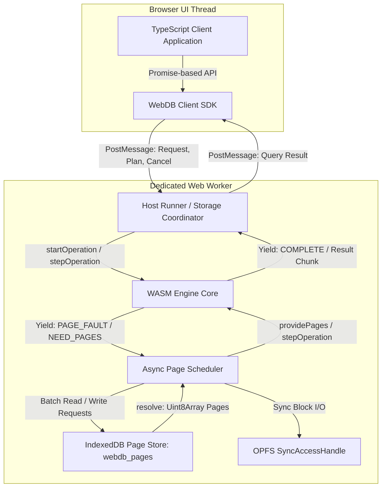

# WebDB Implementation Roadmap & Architecture Plan

This document outlines the end-to-end engineering roadmap to evolve **WebDB** from the initial skeleton into a production-grade, relational SQL database engine written in modern C++20, architected for native execution and WebAssembly in browser environments.

---

## Core Architectural Decisions & Principles

1. **Async Page-Store & Scheduler Architecture**:
   - IndexedDB cannot implement synchronous `read()` / `write()`. Therefore, **IndexedDB is a first-class asynchronous page store**, not a fake synchronous VFS.
   - The engine core uses a **host-driven async page scheduler state machine** (avoiding reliance on heavy Asyncify/JSPI):
     - When an operation needs a page not currently resident in the Buffer Pool, the WASM engine pauses and yields a `PAGE_FAULT` request back to JavaScript.
     - The host (JavaScript runtime in a Web Worker) fetches the required page(s) in batches from IndexedDB and resumes the operation via `providePages()`.
   - The public TypeScript API remains completely async and Promise-based: `await db.execute(plan)`.

2. **Decoupled Page Storage Implementations**:
   - The logical database engine depends on a unified `BufferPoolManager` and `IPageStore` abstraction, not directly on OPFS or IndexedDB.
   - Four distinct backend implementations:
     1. `InMemoryPageStore`: Synchronous in-memory store for unit tests and local CLI.
     2. `IndexedDbPageStore`: Primary universal browser-compatible backend using async page scheduling.
     3. `OpfsPageStore`: High-performance worker-based store using `FileSystemSyncAccessHandle` for synchronous direct block access (or the async scheduler where sync handles are unavailable).
     4. `NativePosixPageStore`: Direct OS block I/O for native development and benchmarking.

3. **Master Page 0 & Circular Bootstrap Prevention**:
   - Page 0 is a fixed **Database Master Page** with a rigid, non-table binary header:
     - Magic identifier: `0x57454244` (`"WEBD"`).
     - Engine format version and canonical page size ($4096$ bytes).
     - Catalog root page IDs: `_system_tables_root_page_id`, `_system_columns_root_page_id`, `_system_indexes_root_page_id`.
     - Active transaction generation ID and commit checkpoint metadata.
   - The engine boots by reading Page 0 directly via known byte offsets, eliminating circular catalog lookup dependencies.

4. **Explicit Durability & Commit Protocol**:
   - Clear separation between pages resident in memory vs. pages durably committed to browser storage.
   - Commits use atomic generation counters and shadow-root / rollback journal updates.
   - IndexedDB transactions must complete and resolve their `oncomplete` event before the engine reports a commit as successful.

5. **Bounded Memory & Resource Policy**:
   - Buffer pool has a strict frame limit ($N$ fixed 4KB frames).
   - In-memory execution operators (sorts, hash joins, aggregations) enforce memory caps.
   - Query results support chunked/cursor streaming across the WASM boundary to avoid massive JSON string allocations in linear memory.
   - Query cancellation support at any scheduler pause point.

6. **Strict 3-Type System & 3VL Semantics**:
   - Only three base types: `INT` (64-bit signed int), `DOUBLE` (64-bit IEEE-754 float), and `TEXT` (variable-length UTF-8). Zero aliases accepted.
   - Rigorous SQL Three-Valued Logic (3VL): Kleene logic for `AND`, `OR`, `NOT`, and `NULL` comparisons (`NULL = NULL -> UNKNOWN`). Filter predicates (`WHERE`) discard non-true (`UNKNOWN` and `FALSE`).

7. **JavaScript User-Defined Functions (JS UDFs)**:
   - Synchronous JS function execution invoked directly from the C++ expression evaluator on the same Web Worker thread via Embind.
   - Avoids compiling heavy C++ utility libraries into WASM (delegates regex, date parsing, and math to JS runtimes).
   - Core constraints: must be strictly synchronous `(a, b) => c`, null-safe (standard SQL functions return `NULL` when inputs are `NULL`), with deterministic/non-deterministic declarations.

8. **Fully Structured Plan IR (Zero SQL Text Parsing in C++)**:
   - Fluent TypeScript SDK generates a 100% structured JSON AST/IR tree.
   - Expressions are pure operator trees (e.g., `{"op": "add", "left": {"col": "score"}, "right": {"lit": 10}}`), with parameter placeholders (`{"param": 0}`).



---

## Detailed Milestone Breakdown

### Phase 1: Storage Format, Dual Master Pages & Slotted Pages
**Objective**: Build a deterministic 4KB block storage layout with canonical Little-Endian encoding, corruption detection, Dual Master Pages for crash-resilient commits, slotted-page record storage with defragmentation, and an abstract page accessor.

> **Full Detailed Specification**: See [plans/01_storage_format.md](plans/01_storage_format.md) for complete byte-level layouts, CRC-32 IEEE 802.3 masking rules, unaligned access safety, RID stability policies, and the test matrix.

- [ ] **1.1 Dual Master Pages (Pages 0 & 1)**: Alternating crash-resilient master pair tracking active generation, catalog roots (`_system_tables`, `_system_columns`, `_system_indexes`), and append-only `page_count`.
- [ ] **1.2 Slotted TablePage Architecture**: Fixed 36-byte header with CRC-32 verification; downward-growing tuple payloads and upward-growing slot directory with in-place defragmentation and trailing dead slot pruning.
- [ ] **1.3 Binary Tuple Serialization & Strict Types**: Fixed-width scalar slots (`INT`, `DOUBLE`) and variable-length `TEXT` payload tail, preceded by format version, flags, and `NullBitmap`.
- [ ] **1.4 TableHeap & Cycle-Protected Scanner**: Doubly-linked chain of `TablePage`s supporting $O(1)$ tail appends, updates with relocation tracking (`UpdateResult`), and cycle-protected scanning.
- [ ] **1.5 Decoupled Page Accessor (`IPageAccessor`)**: Synchronous abstract page interface (`fetch_page`, `allocate_page`, `mark_dirty`, `flush_page`, `sync`) decoupling Phase 1 tests from the Phase 2 async buffer pool.

---

### Phase 2: Host-Driven Async Page Scheduler & Page Store
**Objective**: Introduce a host-driven WASM scheduler that pauses on absent pages, receives page batches from JavaScript, and yields dirty pages for durable host commits.

> **Detailed implementation plan**: [plans/02_async_page_scheduler.md](plans/02_async_page_scheduler.md)

- [ ] Define operation state transitions, page-transfer data types, and a bounded per-operation resident-page cache.
- [ ] Export start/step/provide/flush/cancel/result operations through Embind.
- [ ] Add a worker host protocol and deterministic in-memory async page store for native and WASM tests.
- [ ] Implement an IndexedDB adapter that flushes each dirty-page batch in one `readwrite` transaction and waits for `oncomplete`.
- [ ] Document and test cancellation, invalid protocol inputs, failed page-batch flushes, and restart from durable images.

Phase 2 establishes asynchronous page delivery and page-batch durability. Buffer-pool eviction, shared request deduplication, prefetching, OPFS, and atomic master metadata publication remain later milestones; Phase 4 adds the recoverable page-plus-master commit protocol.

---

### Phase 3: Buffer Pool Manager with Async I/O Awareness
**Objective**: Buffer frames with explicit page states, pin tracking during async pauses, and scan-resistant eviction.

> **Detailed implementation plan**: [plans/03_buffer_pool_manager.md](plans/03_buffer_pool_manager.md)

- [ ] **3.1 Page Frame States & Pin Lifecycle**
  - Explicit frame states:
    - `ABSENT`: Frame is unallocated or empty.
    - `LOADING`: Awaiting host async page load; pinned to prevent premature eviction.
    - `RESIDENT`: In-memory and ready for read/write access.
    - `DIRTY`: Modified in memory; scheduled for flush upon commit/eviction.
    - `FLUSHING`: In-flight being written to storage; pinned against overwrite.
  - **Pin Accounting**: Pinned pages cannot be evicted by the replacement policy. Pins are strictly preserved across async scheduler pause/resume cycles.

- [ ] **3.2 Replacement Policy (Clock / 2Q)**
  - Scan-resistant eviction (e.g., Clock or Two-Queue 2Q algorithm) to prevent large table scans from flushing out frequently accessed catalog or B+ tree index roots.
  - Fixed frame budget (e.g., 256–1024 frames = 1–4 MB RAM).

- [ ] **3.3 Buffer Pool API**
  - `PinPage(page_id_t, out_page)`: Returns `RESIDENT` page pointer, or registers a `PAGE_FAULT` if `ABSENT`.
  - `UnpinPage(page_id_t, bool is_dirty)`: Decrements pin count; sets dirty flag.
  - `NewPage(out_page_id)`: Allocates new page from free list.
  - `CollectDirtyPages()`: Gathers dirty frames into batch for the async flush cycle.

---

### Phase 4: Transactions, Durability & Recovery Protocol
**Objective**: Implement deterministic single-writer ACID durability tailored for browser storage.

- [ ] **4.1 Two-Phase Generation / Shadow-Root Commit Protocol**
  - Single active write transaction at a time.
  - Commit Sequence:
    1. Freeze active dirty pages in the Buffer Pool.
    2. WASM scheduler enters `FLUSHING` state and passes dirty pages to host.
    3. Host writes all dirty pages into `webdb_pages` via a single IndexedDB `readwrite` transaction.
    4. Host updates `webdb_meta` with the incremented `generation_id` and the new Master Page 0.
    5. Host awaits `transaction.oncomplete`.
    6. Host calls `finishFlush(op_id, true)` in WASM to unpin dirty frames and clear dirty flags.
  - **Crash / Interruption Recovery**:
    - On boot, inspect `webdb_meta` to find the last verified `generation_id`.
    - Discard any orphaned pages whose header `generation_id` is greater than the committed metadata.

---

### Phase 5: Indexing (B+ Tree)
**Objective**: B+ Tree index with support for `INT`, `DOUBLE`, and `TEXT` keys, integrated with the async Buffer Pool.

- [ ] **5.1 B+ Tree Page Structure**
  - Header: `PageType` (Leaf vs Internal), `KeyType`, `ItemCount`, `MaxCapacity`, `ParentPageID`, `PageID`.
  - `BPlusTreeInternalPage`: Keys paired with child `page_id_t`.
  - `BPlusTreeLeafPage`: Keys paired with `RID`s, plus `NextPageID` and `PrevPageID` for range scans.

- [ ] **5.2 B+ Tree Operations**
  - Point search: `Search(key) -> vector<RID>`.
  - Range scan: `Scan(min_key, max_key) -> IndexCursor`.
  - Split and merge algorithms:
    - Leaf and internal node splitting on overflow ($N > \text{MaxCapacity}$).
    - Sibling redistribution and node borrowing / merging on underflow.
  - Async page traversal: Traversal yields to the scheduler whenever a child node is not resident.

---

### Phase 6: Catalog & Schema Management
**Objective**: Metadata persistence bootstrapped cleanly from Page 0.

- [ ] **6.1 Catalog Tables**
  - `_system_tables`: `(table_id: INT, table_name: TEXT, root_page_id: INT, first_page_id: INT)`.
  - `_system_columns`: `(column_id: INT, table_id: INT, column_name: TEXT, column_type: INT, column_index: INT, is_nullable: INT, is_primary: INT)`.
    - `column_type`: `1 = INT`, `2 = DOUBLE`, `3 = TEXT`.
    - `is_nullable`: `1 = NULL allowed`, `0 = NOT NULL constraint`.
  - `_system_indexes`: `(index_id: INT, index_name: TEXT, table_id: INT, root_page_id: INT, column_id: INT, is_unique: INT)`.

- [ ] **6.2 Catalog Manager (`CatalogManager`)**
  - Bootstrap: Reads Page 0 header values to locate the roots of `_system_tables` and `_system_columns`.
  - `CreateTable(name, schema) -> TableMetadata*`
  - `GetTable(name) -> TableMetadata*`
  - `DropTable(name) -> bool`
  - `CreateIndex(index_name, table_name, column_name) -> IndexMetadata*`

---

### Phase 7: Structured Plan IR & Fluent TypeScript SDK
**Objective**: Eliminate all SQL string parsing in C++. Use a strictly structured, typed JSON AST/IR with parameter support.

- [ ] **7.1 Structured Plan IR Specification**
  - **Fully Structured Expressions** (no embedded SQL strings like `"score + 10"`):
    ```json
    {
      "op": "select",
      "from": "users",
      "columns": [
        {"col": "id"},
        {"col": "name"},
        {
          "as": "adjusted_score",
          "expr": {
            "op": "add",
            "left": {"col": "score"},
            "right": {"lit": 10.0}
          }
        }
      ],
      "where": {
        "op": "and",
        "args": [
          {"op": "gt", "left": {"col": "id"}, "right": {"param": 0}},
          {"op": "eq", "left": {"col": "status"}, "right": {"lit": "active"}}
        ]
      },
      "params": [100],
      "orderBy": [{"col": "id", "dir": "asc"}],
      "limit": 50,
      "offset": 0
    }
    ```
  - **DDL & DML**:
    - `create_table`: `{"op": "create_table", "table": "users", "columns": [{"name": "id", "type": "INT", "nullable": false, "primary": true}, ...]}`
    - `insert`: `{"op": "insert", "table": "users", "rows": [[1, "Alice", 98.5], [2, "Bob", null]]}`
    - `update`: `{"op": "update", "table": "users", "set": {"score": {"lit": 100.0}}, "where": {...}}`
    - `delete`: `{"op": "delete", "table": "users", "where": {...}}`
  - **Function Call Expressions (JS UDFs & Built-ins)**:
    - `{"op": "call", "fn": "my_custom_fn", "args": [{"col": "score"}, {"lit": 1.15}]}`

- [ ] **7.2 C++ Plan Deserializer & Validator**
  - Deserializes JSON IR directly into `LogicalPlan` nodes.
  - Enforces schema versioning, maximum AST nesting depth (protect against stack overflow), and strict unknown-field rejection.

- [ ] **7.3 Fluent TypeScript SDK (`@webdb/client`)**
  - Worker client communicating via message passing:
    ```typescript
    const db = await WebDB.open({
      name: 'analytics_db',
      storage: 'auto' // 'opfs' | 'indexeddb' | 'memory'
    });

    // Type-safe schema definition
    await db.createTable('users', {
      id: { type: 'INT', primary: true },
      name: { type: 'TEXT' },
      score: { type: 'DOUBLE', nullable: true }
    });

    // Fluent query builder
    const rows = await db.table('users')
      .where(col('score').gte(90.0).and(col('status').eq('active')))
      .select('id', 'name', { expr: col('score').add(10), as: 'adjusted_score' })
      .orderBy('id', 'asc')
      .limit(50)
      .execute();
    ```
  - **UDF Registration API**:
    - `db.registerFunction('calc_tax', (price: number, rate: number): number => price * (1 + rate), { deterministic: true })`.

---

### Phase 8: Query Planner, 3VL Evaluator & Volcano Executors
**Objective**: Execute plans row-by-row using the Volcano iterator model, with SQL Three-Valued Logic and resource limits.

- [ ] **8.1 Three-Valued Logic (3VL) Expression Evaluator & UDF Dispatcher**
  - Kleene logic matrix:
    - Comparisons with `NULL` evaluate to `UNKNOWN` (`NULL = NULL -> UNKNOWN`).
    - `AND`: `TRUE AND UNKNOWN = UNKNOWN`, `FALSE AND UNKNOWN = FALSE`.
    - `OR`: `TRUE OR UNKNOWN = TRUE`, `FALSE OR UNKNOWN = UNKNOWN`.
    - `NOT`: `NOT UNKNOWN = UNKNOWN`.
  - `WHERE` clause semantics: Only rows evaluating strictly to `TRUE` pass; `UNKNOWN` and `FALSE` are filtered out.
  - **UDF Host Callback Dispatcher**:
    - Synchronous scalar invocation across WASM boundary via Embind (`emscripten::val`).
    - Automatic NULL short-circuiting: returns `NULL` immediately if any strict argument is `NULL`.
    - Graceful error translation if a JS UDF throws an exception.

- [ ] **8.2 Volcano Iterator Model with Async Suspension**
  - Standard iterator interface:
    - `Init() -> ExecutionStatus` (returns `NEED_PAGES` if child page is absent).
    - `Next(Tuple* out_tuple, RID* out_rid) -> ExecutionStatus` (`SUCCESS`, `NEED_PAGES`, `EXHAUSTED`).
  - **Physical Operators**:
    - `SeqScanExecutor`: Scans table heap with bounded prefetch page requests.
    - `IndexScanExecutor`: Traverses B+ Tree for point lookups and range scans.
    - `FilterExecutor`: Evaluates 3VL predicates on child tuples.
    - `ProjectionExecutor`: Evaluates expressions and projects output columns.
    - `NestedLoopJoinExecutor` & `HashJoinExecutor`: Inner and left outer joins.
    - `AggregateExecutor`: `COUNT`, `SUM`, `AVG`, `MIN`, `MAX` with optional `GROUP BY`.
    - `SortExecutor`: Bounded in-memory sort with memory cap protection.
    - `LimitExecutor`: Restricts output count and applies offset.
    - `InsertExecutor`, `UpdateExecutor`, `DeleteExecutor`: DML execution.

- [ ] **8.3 Bounded Output Serialization**
  - Streaming chunked serialization (`fetch_next_chunk(batch_size)`).
  - Eliminates multi-megabyte monolithic JSON string allocations in WASM linear memory.

---

### Phase 9: Testing, Quality Assurance & Verification
**Objective**: Complete verification suite across all storage backends.

- [ ] **9.1 Scheduler & Storage Integration Tests**
  - Page-load suspension and resumption verification.
  - Batched page read tests (confirming single multi-key IndexedDB request).
  - Batched write tests (confirming dirty pages flush in one transaction).
  - Duplicate page request deduplication tests.
  - Prefetch boundary tests during sequential table scans.
  - Query cancellation tests while waiting for simulated slow storage.
  - IndexedDB transaction error handling & rollback verification.
  - Crash recovery after interrupted commit (generation ID validation).
  - Buffer pool eviction tests under async page loading pressure.
  - Parity tests: Identical query outputs across `InMemory`, `IndexedDb`, and `Opfs` backends.

- [ ] **9.2 Benchmarking & Stress Tests**
  - Micro-benchmarks: Point lookups vs full table scans on IndexedDB and OPFS.
  - Memory leak verification in long-running browser worker sessions.

---

## Ordered Step-by-Step Implementation Sequence

```text
Step 1: Slotted Page Layout & Master Page 0 (Phase 1.1 - 1.3)
   └── Deliverable: Binary 4KB pages with canonical Little-Endian encoding, CRC32, Master Page 0.
Step 2: Async Page Scheduler & In-Memory / IndexedDB Page Store (Phase 2.1 - 2.4)
   └── Deliverable: WASM engine suspension on page fault and resumption via host batching.
Step 3: Buffer Pool Manager with Pin Preservation & State Machine (Phase 3.1 - 3.3)
   └── Deliverable: Frame states (Absent, Loading, Resident, Dirty, Flushing) with Clock eviction.
Step 4: Table Heap & Basic Sequential Scan (Phase 1.4 & 8.2)
   └── Deliverable: Multi-page table storage with async page prefetching.
Step 5: Catalog Manager & Schema Persistence (Phase 6.1 - 6.2)
   └── Deliverable: Non-circular bootstrap from Page 0 with table/column metadata persistence.
Step 6: Structured Plan IR & Fluent TypeScript SDK (Phase 7.1 - 7.3)
   └── Deliverable: Pure JSON AST deserializer and type-safe TypeScript builder client.
Step 7: Volcano Execution Operators & 3VL Expression Evaluator (Phase 8.1 - 8.3)
   └── Deliverable: End-to-end execution of CREATE, INSERT, SELECT, WHERE, and LIMIT.
Step 8: Two-Phase Commit & Crash Recovery (Phase 4.1)
   └── Deliverable: Atomic IndexedDB transaction commits with generation ID validation.
Step 9: B+ Tree Indexing & IndexScan (Phase 5.1 - 5.2)
   └── Deliverable: B+ Tree primary key lookups and range scans over async storage.
Step 10: OPFS Dedicated Worker Driver & Advanced Operators (Phase 2.5 & 8.2)
   └── Deliverable: SyncAccessHandle OPFS driver, joins, aggregates, and streaming cursors.
```
