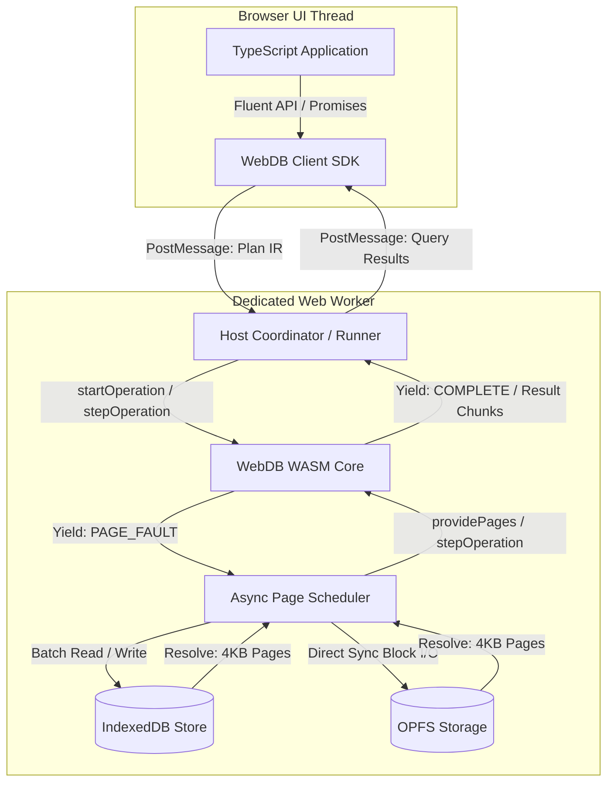

# <div align="center">🗄️ WebDB</div>

<div align="center">

**A featherlight, browser-first relational database engine implemented from scratch in modern C++20 and compiled to WebAssembly.**

[](#project-status--roadmap)
[](LICENSE)
[](https://en.cppreference.com/w/cpp/20)
[](https://webassembly.org/)
[](#4--first-class-indexeddb-and-opfs-storage)
[](#2--single-threaded-simplicity--determinism)
[](#7--fluent-query-builder--zero-sql-parser-overhead)

[Overview](#overview) • [Core Values](#core-values--guiding-principles) • [Key Features](#key-features) • [WebDB vs SQLite WASM](#webdb-vs-sqlite-wasm) • [Architecture](#architecture-overview) • [API Preview](#target-browser-api-preview) • [Roadmap](#project-status--roadmap) • [Contributing](#contributing)

</div>

> 🚧 **Active Development & Community**
> WebDB is currently under active development. If you are excited about the vision of a lightweight, truly browser-native relational database, please consider **starring the repository ⭐**, **sharing it with the web & systems community 📢**, and **submitting your feedback, use cases, or ideas 💬** in issues and discussions to help shape the future of WebDB!

---

## Overview

**WebDB** is an embedded relational database engine architected specifically for the modern web platform. Rather than porting a legacy native database with heavyweight compatibility layers, WebDB is built from the ground up to leverage browser primitives, asynchronous storage runtimes, and native Web APIs.

WebDB compiles to a featherlight WebAssembly (WASM) binary with zero external runtime dependencies. By delegating complex operations like dates, regular expressions, and string formatting to browser APIs and JavaScript User-Defined Functions (UDFs), and by using a type-safe fluent query API instead of an in-engine SQL text parser, WebDB delivers high performance, predictable memory usage, and minimal bundle sizes.

---

## Core Values & Guiding Principles

To ensure consistency and focus, all contributions and architectural decisions in WebDB are guided by these core principles:

### 1. 🌐 Browser-First by Purpose
WebDB is conceived, designed, and optimized specifically for the browser environment. While native C++ compilation is fully supported for unit testing, benchmarking, and debugging, every architectural tradeoff prioritizes web constraints: quick cold-start times, minimal memory consumption, responsive main threads, and seamless execution inside Web Workers.

### 2. ⚡ Single-Threaded Simplicity & Determinism
The core engine contains zero threading primitives (`std::thread`, `pthread`, mutexes, or atomic locks). This eliminates synchronization overhead, prevents race conditions, guarantees deterministic execution, and keeps the engine lightweight. Most importantly, it allows WebDB to run in standard Web Workers without requiring complex server deployment headers like Cross-Origin Opener Policy (`COOP`) or Cross-Origin Embedder Policy (`COEP`), which are mandatory for `SharedArrayBuffer` and multithreaded WASM.

### 3. 🪶 Minimal by Design & Web API Delegation
Every byte in the WASM payload matters. WebDB resists the urge to reimplement features that the browser environment already provides natively. Date parsing, time zone math, regular expressions, cryptographic operations, and internationalization are delegated to JavaScript and Web APIs through User-Defined Functions (UDFs) rather than embedding bulky third-party C/C++ libraries into the binary.

### 4. 💾 First-Class IndexedDB and OPFS Storage
WebDB treats browser storage layers as first-class citizens. It provides universal browser compatibility via an asynchronous IndexedDB page store and unlocks high-throughput block I/O through the Origin Private File System (OPFS) `FileSystemSyncAccessHandle` inside dedicated workers.

### 5. 🔄 Asynchronous Architecture by Design
Traditional databases rely on synchronous block I/O (`read()`, `write()`, `fsync()`), which does not exist in standard browser environments (e.g., IndexedDB). Instead of relying on heavy runtime shims such as Emscripten Asyncify or experimental JSPI, WebDB features a host-driven cooperative state machine. When an operation requires a non-resident page, the WASM engine yields a `PAGE_FAULT` back to JavaScript, allowing the host to resolve pages asynchronously and resume execution.

### 6. 🧩 JavaScript User-Defined Functions (UDFs)
Extensibility is built directly into query evaluation. Applications can register synchronous JavaScript functions that execute directly on the worker thread during query execution. This provides a clean escape hatch for custom business logic, domain transforms, and complex calculations without bloating the WASM core.

### 7. 🪄 Fluent Query Builder & Zero SQL Parser Overhead
Traditional SQL database engines spend tens of kilobytes of binary space on lexers, AST builders, and SQL text parsers. WebDB eliminates the SQL text parser from the WASM binary entirely. Instead, a type-safe, fluent TypeScript client library compiles queries into a compact JSON Intermediate Representation (Plan IR) that the C++ execution engine evaluates directly.

---

## Key Features

- **Crash-Resilient Dual Master Pages**: Alternating master pages (Page 0 and Page 1) ensure atomic publication of database metadata, active transaction generations, and catalog root pointers.
- **Slotted-Page Architecture**: 4096-byte pages with CRC-32 IEEE 802.3 checksum verification, 36-byte deterministic headers, in-place defragmentation, and trailing dead-slot pruning.
- **Strict 3-Type System with SQL 3VL**: Supports exactly three scalar types—`INT` (64-bit signed), `DOUBLE` (64-bit IEEE 754), and `TEXT` (UTF-8 validated)—with full SQL Three-Valued Logic (`TRUE`, `FALSE`, `UNKNOWN`) for `NULL` handling.
- **Bounded Buffer Pool & Streaming**: Frame-limited buffer pool management and cursor-based streaming results across the WASM boundary prevent memory pressure and out-of-memory crashes on mobile browsers.
- **Isolated WASM Interface**: Clean boundary architecture where the engine core in [src/](src/) remains 100% standard C++20 without WebAssembly or Emscripten headers. All bindings are cleanly isolated in [wasm/bindings.cpp](wasm/bindings.cpp).
- **Rigorous Test Suite & Verification**: Thoroughly tested for corruption detection, endian safety, slot compaction, and edge-case invariants (documented in [docs/fixed-issues.md](docs/fixed-issues.md)).

---

## WebDB vs. SQLite WASM

SQLite compiled to WebAssembly is a battle-tested, general-purpose SQL database. WebDB is an intentionally focused alternative designed specifically for web applications where bundle size, browser-native storage, and zero-configuration worker setups are paramount.

| Architectural Feature | WebDB | SQLite (WASM Build) | Advantage of WebDB |
|---|---|---|---|
| **Primary Target** | **Browser-first**; native builds are for testing/tooling | Native-first C codebase ported to WASM | Native alignment with browser security and lifecycle models |
| **Binary Footprint** | **Ultra-lightweight** (minimal core, no bundled utility libraries) | Significantly larger (includes full SQL engine and utilities) | Fast cold starts, lower bandwidth, ideal for mobile web apps |
| **SQL Text Parser** | **Zero in WASM**; fluent TypeScript SDK compiles structured Plan IR | Full SQL lexer/parser embedded in WASM binary | Saves substantial WASM binary footprint; provides compile-time type safety |
| **Browser Storage** | **Native async scheduler** for IndexedDB + OPFS worker sync | Relies on synchronous VFS shims or Asyncify translation | Non-blocking IndexedDB support without the performance overhead of Asyncify |
| **Threading & Deployment** | **Single-threaded by design**; standard Web Worker execution | Multithreading requires `SharedArrayBuffer` & `pthreads` | Zero server header constraints; runs without `COOP`/`COEP` isolation requirements |
| **Utility Delegation** | **Web APIs & JS** (dates, regex, math delegated to host) | Reimplemented C libraries compiled into the binary | Eliminates duplicate implementations already available in modern JS engines |
| **Query Extensibility** | **Direct JS UDFs** evaluated synchronously in Web Worker | C extension modules or complex JS bridging layers | Frictionless integration with application-level JavaScript logic |
| **Type System** | **Strict 3-Type core** (`INT`, `DOUBLE`, `TEXT`) + 3VL `NULL` | Dynamic manifest typing with multiple type conversions | Predictable memory layouts, compact serialization, and simpler debugging |
| **Query Cancellation** | **Native pause-point cancellation** in scheduler state machine | Interrupt handlers or worker termination | Safe, immediate cancellation without thread termination or storage corruption |

---

## Architecture Overview

WebDB uses a decoupled, host-driven asynchronous architecture designed to keep the browser's main UI thread completely responsive while executing heavy database operations inside a dedicated Web Worker:



### Architectural Flow:
1. **UI Thread**: Applications interact via a type-safe, Promise-based TypeScript client that translates fluent queries into structured Plan IR trees.
2. **Dedicated Web Worker**: The client sends query plans to the worker host runner, preventing database processing from freezing UI animations or input.
3. **WASM Engine Core**: Executes query operators directly in WebAssembly linear memory without compiling bulky SQL parsers.
4. **Async Page Scheduler**: When a query requires a page not present in the buffer pool, the WASM engine yields a `PAGE_FAULT` back to JavaScript. The host fetches missing pages in batches from IndexedDB or via synchronous OPFS file handles and resumes the engine cooperatively.
5. **Streaming Results**: Output records are streamed back to the client in memory-bounded chunks with full query cancellation support at any scheduler pause point.

---

## Project Status & Roadmap

WebDB is organized into four sequential development phases:

- **Phase 1: Storage Foundation** *(Current)*
  - Dual Master Pages with crash-resilient generation alternation.
  - Slotted table pages with CRC-32 integrity checks and compaction.
  - Binary tuple encoding for `INT`, `DOUBLE`, and `TEXT`.
  - Doubly-linked `TableHeap` scanner and abstract `IPageAccessor`.
  - Full details available in [plans/01_storage_format.md](plans/01_storage_format.md).
- **Phase 2: Browser Persistence & Async Scheduler**
  - Host-driven async page scheduler state machine (`PAGE_FAULT` yielding).
  - IndexedDB backend (`webdb_pages`) with transactional multi-page batching.
  - High-performance OPFS backend with `FileSystemSyncAccessHandle`.
  - Bounded buffer pool manager and dirty page eviction.
- **Phase 3: Relational Query Engine & Indexing**
  - System catalogs (`_system_tables`, `_system_columns`, `_system_indexes`).
  - B-Tree index storage and point/range lookups.
  - Plan IR execution: sequential scan, index scan, filter, projection, hash join, and aggregate.
  - JavaScript UDF registration and invocation protocol.
- **Phase 4: Production Hardening & Optimization**
  - Chunked cursor streaming across the WASM boundary.
  - Online vacuuming and space reclamation.
  - Benchmarking suite comparing IndexedDB vs OPFS vs in-memory performance.

See [PLAN.md](PLAN.md) for the complete engineering plan and milestone checklist.

---

## Getting Started & Building

### Prerequisites

#### Native Development
- C++20 compliant compiler (Apple Clang 13+, GCC 10+, or Clang 11+)
- CMake 3.20 or newer
- GNU Make or Ninja

#### WebAssembly Compilation
- [Emscripten SDK (emsdk)](https://emscripten.org/docs/getting_started/downloads.html) v3.1.0+

```bash
# Clone and activate the Emscripten SDK
git clone https://github.com/emscripten-core/emsdk.git
cd emsdk
./emsdk install latest
./emsdk activate latest
source ./emsdk_env.sh
```

---

### Build Commands

#### Native Build & Tests

Configure and build native targets directly with CMake:

```bash
# Configure the native build into dist/native
cmake -S . -B dist/native

# Compile the native CLI and test suite
cmake --build dist/native

# Run the test suite
ctest --test-dir dist/native --output-on-failure
```

Run the native CLI binary:
```bash
./dist/native/webdb_cli
```

#### WebAssembly (WASM) Build

Compile the WebAssembly module using Emscripten:

```bash
# Configure the WASM build (size-optimized production mode)
emcmake cmake -S . -B dist/wasm -DWEBDB_WASM_SIZE_OPTIMIZED=ON

# Compile the WASM artifacts
cmake --build dist/wasm
```

This generates:
- `dist/wasm/webdb.js`: ES6 module wrapper and Embind loader.
- `dist/wasm/webdb.wasm`: Optimized WebAssembly database binary.

---

## Target Browser API (Preview)

> **Note**: WebDB is currently in **Phase 1** (Storage Foundation). The snippet below illustrates the planned developer experience and API design for the upcoming TypeScript SDK as the engine progresses through Phase 2 (Browser Persistence) and Phase 3 (Relational Query Engine).

Instead of parsing raw SQL strings inside the WASM binary, WebDB will provide a type-safe, fluent TypeScript client that compiles queries directly to a structured Plan IR:

### 1. Installation & Initialization (Planned)

```typescript
import { WebDB, col, lit } from '@webdb/client';

// Initialize WebDB with your preferred browser storage backend
const db = await WebDB.open({
  name: 'my_app_db',
  storage: 'indexeddb', // or 'opfs' for high-performance worker access
  workerUrl: new URL('./webdb.worker.js', import.meta.url)
});
```

### 2. Table Definition & Data Insertion (Planned)

```typescript
// Define schema
await db.schema.createTable('users', {
  id: { type: 'INT', primaryKey: true },
  name: { type: 'TEXT', nullable: false },
  role: { type: 'TEXT', nullable: false },
  score: { type: 'DOUBLE' }
});

// Insert rows with type safety
await db.table('users').insert([
  { id: 1, name: 'Alice', role: 'Admin', score: 95.5 },
  { id: 2, name: 'Bob', role: 'Engineer', score: 88.0 },
  { id: 3, name: 'Charlie', role: 'Designer', score: 92.3 }
]);
```

### 3. Fluent Querying & JS UDF Registration (Planned)

```typescript
// Register a custom JavaScript UDF for browser-native logic (e.g., regex / transforms)
db.registerFunction('matchesRole', (role: string, pattern: string) => {
  return new RegExp(pattern, 'i').test(role);
});

// Build and execute a fluent query
const results = await db
  .table('users')
  .select('id', 'name', 'role', 'score')
  .where(col('score').gte(90.0))
  .and(col('role').fn('matchesRole', lit('^Admin|Designer$')))
  .orderBy(col('score').desc())
  .limit(10)
  .execute();

console.log(results);
// [
//   { id: 1, name: "Alice", role: "Admin", score: 95.5 },
//   { id: 3, name: "Charlie", role: "Designer", score: 92.3 }
// ]
```

### 4. Under the Hood: Generated Plan IR

The fluent TypeScript API compiles query expressions directly into structured JSON Plan IR before sending them across the Web Worker boundary:

```json
{
  "type": "QUERY_PLAN",
  "root": {
    "op": "LIMIT",
    "count": 10,
    "input": {
      "op": "ORDER_BY",
      "fields": [{ "col": "score", "direction": "DESC" }],
      "input": {
        "op": "FILTER",
        "predicate": {
          "op": "AND",
          "left": { "op": "GTE", "left": { "col": "score" }, "right": { "lit": 90.0 } },
          "right": { "op": "UDF", "name": "matchesRole", "args": [{ "col": "role" }, { "lit": "^Admin|Designer$" }] }
        },
        "input": {
          "op": "SCAN",
          "table": "users",
          "projections": ["id", "name", "role", "score"]
        }
      }
    }
  }
}
```

---

## Repository Structure

- [CMakeLists.txt](CMakeLists.txt): Root CMake build configuration with native and Emscripten targets.
- [PLAN.md](PLAN.md): Complete architecture blueprint, phase breakdown, and scheduler specification.
- [plans/01_storage_format.md](plans/01_storage_format.md): Specification for 4KB pages, dual master pages, slotted pages, and tuple encoding.
- [docs/fixed-issues.md](docs/fixed-issues.md): Engineering lessons, root-cause analyses, and critical issue fixes.
- [src/](src/): Pure C++20 database engine core (free of WebAssembly dependencies).
  - [src/engine.cpp](src/engine.cpp): Top-level SQL engine orchestration.
  - [src/storage/](src/storage/): Slotted pages, master pages, tuples, and table heap implementations.
  - [src/common/](src/common/): CRC-32 checksums and endian utilities.
  - [src/include/](src/include/): Core header definitions and public interfaces.
- [wasm/](wasm/): Isolated WebAssembly Embind bridge.
  - [wasm/bindings.cpp](wasm/bindings.cpp): C++ to JavaScript bindings and export surface.
- [tests/](tests/): Comprehensive native unit and integration test suite.
  - [tests/test_storage.cpp](tests/test_storage.cpp): Test suite covering page allocation, slotted page compaction, and data integrity.

---

## Contributing

Contributions that align with WebDB's core values are welcome! Before opening a pull request:

1. Review [PLAN.md](PLAN.md) and [plans/01_storage_format.md](plans/01_storage_format.md) to understand architectural boundaries.
2. Ensure changes remain strictly single-threaded and preserve minimal binary footprint.
3. Verify that native unit tests pass: `ctest --test-dir dist/native`.
4. Consult [docs/fixed-issues.md](docs/fixed-issues.md) for known pitfalls, unaligned memory rules, and invariant requirements.

---

## License

WebDB is open-source software licensed under the MIT License.
