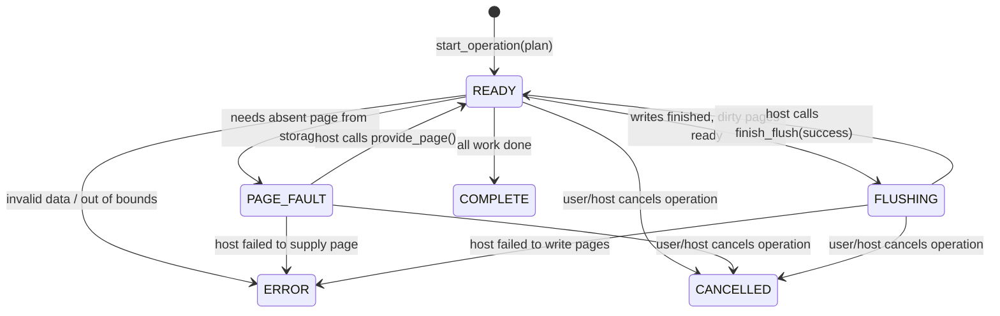

# WebDB Internals Handbook — Phase 2: Host-Driven Async Page Scheduler

> **Who is this guide for?**
> You do **not** need to know C++, nor do you need prior experience with WebAssembly or database engines. This guide explains how WebDB bridges the gap between C++ and JavaScript using an asynchronous cooperative state machine.

---

## 1. The Core Problem: WebAssembly and the Browser Event Loop

In a standard C++ desktop database like PostgreSQL or SQLite:
1. When code wants to read Page 42, it calls the operating system: `read(file_descriptor, buffer, 4096)`.
2. The operating system pauses the C++ thread.
3. The hard drive reads the data.
4. When the data arrives, the operating system wakes up the C++ thread, and execution continues on the very next line.

This is called **Synchronous Blocking I/O**.

### Why This Fails in a Web Browser

In a web browser:
1. JavaScript runs on a **single main thread** (the browser event loop).
2. All persistent browser storage—such as **IndexedDB** or the **Origin Private File System (OPFS)**—is **Asynchronous** (based on JavaScript `Promise`s and `async/await`).
3. **WebAssembly cannot block the thread waiting for a Promise.** If C++ halts and waits for an IndexedDB read to complete, the entire browser tab freezes! The browser cannot process UI events, and it cannot run the IndexedDB callback that would deliver the data! You get an instant deadlock.

```
Synchronous I/O (Impossible in Browser WASM):
C++ Engine:  "Give me Page 5"  ====>  [Thread BLOCKS waiting for disk]  ====>  Browser Tab Hangs!

Asynchronous Cooperative I/O (How WebDB Solves It):
C++ Engine:  "I need Page 5. I am pausing myself now!"  ====> Returns control to JS.
JavaScript:  Awaits IndexedDB.readPages([5]) in background.
JavaScript:  "Here is Page 5!"  ====> Hands bytes to C++ and resumes C++ execution.
```

Phase 2 invents a **Host-Driven Asynchronous Scheduler** to make this cooperative dance work cleanly and safely.

---

## 2. The Cooperative State Machine

Instead of running an entire query in one big C++ loop, WebDB breaks query execution down into discrete steps.

An operation is governed by a simple, predictable state machine:



### The Six Scheduler States

| State | Who Has Control? | What Does It Mean? |
| :--- | :--- | :--- |
| `READY` | **C++ Engine** | The operation is ready to make forward progress. Calling `step_operation()` will execute the next chunk of work. |
| `PAGE_FAULT` | **JavaScript Host** | C++ cannot continue because it needs one or more pages that are not in memory. Control is yielded to JavaScript to fetch them from IndexedDB. |
| `FLUSHING` | **JavaScript Host** | C++ has modified pages and placed them in a dirty snapshot. Control is yielded to JavaScript to write them durably to IndexedDB. |
| `COMPLETE` | **Finished** | The operation succeeded. The results are available to read. |
| `CANCELLED` | **Finished** | The user or host aborted the operation. |
| `ERROR` | **Finished** | A fatal error occurred (bad input, disk failure, corruption). Diagnostics are available to inspect. |

---

## 3. The Step-by-Step Execution Lifecycle

Let's walk through an actual operation: a client wants to read Page 2 and Page 3, and then write byte `42` to Page 2 at offset `64`.

```json
{
  "version": 1,
  "reads": [2, 3],
  "writes": [
    {"page_id": 2, "byte_offset": 64, "value": 42}
  ]
}
```

Here is the exact choreography between JavaScript and C++:

### Step 1: Starting the Operation
- JavaScript calls:
  ```typescript
  const opId = scheduler.startOperation(planJson);
  ```
- C++ parses and validates the JSON plan. If valid, it assigns a unique 64-bit ID (`opId = 1`) and sets the state to `READY`.

### Step 2: The First Page Fault (Reading Page 2)
- JavaScript calls:
  ```typescript
  let status = scheduler.stepOperation(opId);
  ```
- C++ checks if Page 2 is in memory. It is not!
- C++ records `pending_page_request = 2`, transitions to `PAGE_FAULT`, and returns immediately.
- JavaScript inspects `status`: it sees `SchedulerStatus.PageFault`.
- JavaScript asks C++:
  ```typescript
  const pageIds = scheduler.getPendingPageIds(opId); // returns [2]
  ```

### Step 3: Fetching from IndexedDB and Resuming
- JavaScript asynchronously reads Page 2 from browser storage:
  ```typescript
  const pages = await indexedDBStore.readPages([2]);
  const page2Bytes = pages.get(2);
  ```
- JavaScript passes the 4,096 bytes into C++:
  ```typescript
  scheduler.providePage(opId, 2, page2Bytes);
  ```
- C++ copies the bytes into its internal resident page cache, clears the pending fault, and transitions back to `READY`.

### Step 4: The Second Page Fault (Reading Page 3)
- JavaScript calls `stepOperation(opId)` again.
- C++ sees Page 2 is now resident! It advances to Page 3.
- Page 3 is not in memory -> C++ yields `PAGE_FAULT` for Page 3.
- JavaScript fetches Page 3 from IndexedDB and calls `providePage(opId, 3, page3Bytes)`.
- Status returns to `READY`.

### Step 5: Applying Mutations and Flushing
- JavaScript calls `stepOperation(opId)`.
- C++ sees both Page 2 and Page 3 are resident.
- C++ applies the requested mutation: it changes byte 64 of Page 2 to `42`.
- Because memory was modified, C++ creates a **dirty page snapshot**, transitions to `FLUSHING`, and yields control to JavaScript.
- JavaScript asks C++:
  ```typescript
  const dirtyIds = scheduler.getDirtyPageIds(opId); // returns [2]
  const dirtyBytes = scheduler.copyDirtyPage(opId, 2);
  ```

### Step 6: Atomic Host Persistence
- JavaScript puts the dirty pages into an IndexedDB `readwrite` transaction:
  ```typescript
  await indexedDBStore.writePages(dirtyPagesMap);
  ```
- When the transaction successfully commits (`oncomplete`), JavaScript tells C++:
  ```typescript
  scheduler.finishFlush(opId, true);
  ```
- C++ marks the dirty pages as clean and transitions to `READY`.

### Step 7: Completion
- JavaScript calls `stepOperation(opId)` one final time.
- C++ sees all reads and writes are done and flushed.
- C++ sets state to `COMPLETE`.
- JavaScript retrieves results and cleans up:
  ```typescript
  const result = scheduler.getExecutionResults(opId);
  scheduler.releaseOperation(opId); // Frees all memory in C++
  ```

---

## 4. Cooperative Cancellation: Preventing Zombie Operations

What happens if a user navigates away from the page, or clicks "Cancel Search", while IndexedDB is in the middle of a 2-second read?

In traditional systems, cancelling asynchronous workflows can cause race conditions:
- The asynchronous storage callback resolves late.
- It injects data into an operation that was already destroyed, causing memory corruption or crash.

### How WebDB Handles Cancellation Safely

1. The JavaScript coordinator accepts an `AbortSignal`:
   ```typescript
   await runOperation(scheduler, store, plan, abortController.signal);
   ```
2. If `signal.aborted` fires while waiting for an IndexedDB Promise:
   - JavaScript catches the abort and immediately calls `scheduler.cancelOperation(opId)`.
   - C++ transitions the operation to `CANCELLED`.
3. If the IndexedDB Promise later resolves, JavaScript checks `signal.aborted`. It **discards the bytes** and refuses to call `providePage()`.
4. Even if a malfunctioning host tries to call `providePage()` on a `CANCELLED` operation, C++ strictly rejects the call with `StorageResult::INVALID_ARGUMENT`.
5. Finally, `scheduler.releaseOperation(opId)` drops all memory associated with that operation.

---

## 5. Clean Layering: Keeping C++ and Browser Code Decoupled

A critical design principle of WebDB is that the core C++ database engine must remain 100% pure and independent of WebAssembly or browser APIs.

The repository achieves this through clean isolation:

```
[ Browser UI / Worker ]
        │
        ▼
[ web/src/operation-coordinator.ts ]  <── Manages the async while-loop & Promises
        │
        ▼
[ web/src/wasm-scheduler-bridge.ts ]   <── Converts JS Uint8Array <──> Embind vectors
        │
        ▼
[ wasm/bindings.cpp ]                 <── Emscripten Embind boundary (No DB logic)
        │
        ▼
[ src/storage/operation_scheduler.cpp] <── Pure standard C++20 State Machine
```

- **`src/`**: Pure C++20. Knows nothing about WebAssembly, browsers, or Emscripten headers. Can be compiled and tested on native Linux or macOS.
- **`wasm/`**: Contains only the Embind adapter. Exposes C++ types to JavaScript. Converts 64-bit operation IDs to decimal strings to avoid JavaScript precision loss.
- **`web/`**: TypeScript library containing the IndexedDB driver and the asynchronous driving loop (`runOperation`).

---

## 6. Open Questions, Contradictions & Limitations in Phase 2

While Phase 2 establishes the async protocol, it was intentionally built with several simplifications that Phase 3 and Phase 4 must address:

1. **Per-Operation Memory Duplication (No Sharing)**:
   - *The Problem:* In Phase 2, every operation has its own private `unordered_map<page_id_t, std::vector<uint8_t>> resident_pages`.
   - *The Consequence:* If 10 concurrent operations all read Page 2, there are 10 separate 4,096-byte copies in memory! There is no sharing, and duplicate loads are not deduplicated. This is the primary problem solved by **Phase 3 (Shared Buffer Pool Manager)**.
2. **Coordinator Expects Exactly One Page per Fault**:
   - *The Contradiction:* The C++ scheduler API returns `std::vector<page_id_t>`, theoretically allowing batch page requests. However, in `web/src/operation-coordinator.ts` (line 40), the TypeScript coordinator strictly checks:
     ```typescript
     if (pageIds.length !== 1) {
       scheduler.failOperation(operationId, "Scheduler returned an invalid page-fault request.");
     }
     ```
     This means if C++ ever returns a batch of 2 or more missing pages, the TypeScript coordinator will immediately crash the operation! Phase 3 must update this loop to handle arbitrary batch sizes.
3. **No Eviction (Memory Leaks on Large Scans)**:
   - *The Problem:* In Phase 2, once an operation loads a page into memory, that page stays resident until the operation finishes and is released.
   - *The Consequence:* An operation that reads 1,000 pages will consume 4 MB of memory without ever freeing pages it no longer needs.
4. **No Multi-Page Atomic Commit**:
   - *The Limitation:* If an operation modifies Page 2 and Page 3, IndexedDB writes both pages in one transaction. But if the browser tab crashes after writing the pages, the database has updated table pages without having updated Master Page 0! Atomic publication of data pages alongside master metadata is deferred to **Phase 4**.
