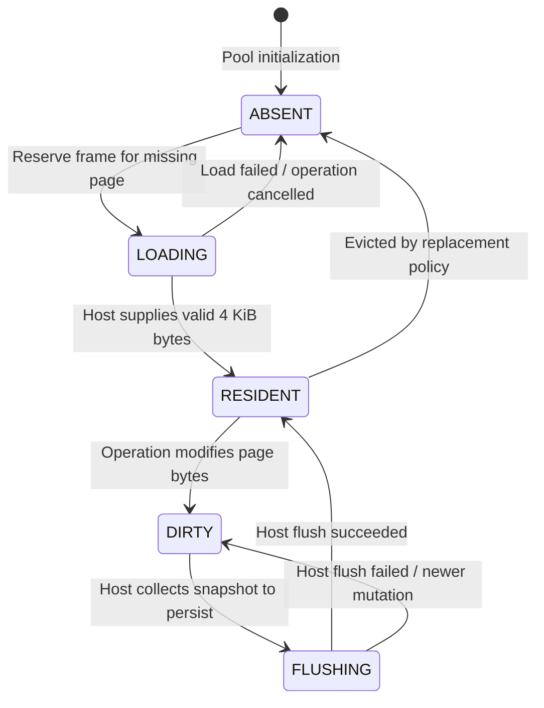

# WebDB Internals Handbook — Phase 3: Buffer Pool Manager with Async I/O Awareness

> **Who is this guide for?**
> You do **not** need to know C++, nor do you need a computer science degree. This guide explains how databases cache pages in memory, evict old data, and coordinate concurrent reads using plain language, relatable analogies, ASCII diagrams, and visual illustrations.

---

## 1. Why Do We Need a Buffer Pool?

In **Phase 2**, each database operation kept its own private list of pages in memory.
While this was easy to build, it had two fatal flaws:

1. **Massive Memory Waste (No Sharing)**:
   If 5 queries all wanted to read the `users` table on Page 2, WebDB loaded Page 2 five separate times, creating 5 duplicate copies in RAM.
2. **Uncontrolled Memory Growth (No Eviction)**:
   If an operation scanned a table with 10,000 pages, it loaded all 10,000 pages (40 Megabytes) into memory and never freed them until the entire operation finished.

A real database cannot afford this. Physical memory (RAM) is expensive and limited, especially inside a browser tab where memory limits are strict.

**The Solution:** The **Buffer Pool Manager (BPM)**.

---

## 2. Fundamental Metaphor: Hotel Rooms vs. Guests

To understand a buffer pool, think of a **Hotel**:

| Database Term | Hotel Analogy | Explanation |
| :--- | :--- | :--- |
| **Page** | **A Person (Guest)** | A block of data that lives permanently in storage (IndexedDB). There can be millions of pages. |
| **Frame** | **A Hotel Room** | A fixed slot in physical RAM. There are only a fixed number of rooms (e.g., 64 rooms). |
| **Buffer Pool** | **The Hotel** | The manager that decides which guest gets which room, and who gets checked out when the hotel is full. |
| **Pinning** | **Locking the Door** | A guest is actively using the room. The hotel manager **cannot evict** this person to make room for someone else! |
| **Unpinning** | **Unlocking the Door** | The guest stepped out. They still have their belongings in the room, but if the hotel gets completely full, the manager can pack their bags and evict them. |

```
    [ Database on Disk: Millions of Pages ]
                     │
                     ▼ (Loaded into memory on demand)
    +-----------------------------------------------+
    |            BUFFER POOL (Fixed 64 Frames)      |
    | Frame 0: Page 2 (Pinned by Query A)           |
    | Frame 1: Page 5 (Unpinned, Clean)             |
    | Frame 2: Page 9 (Pinned by Query B)           |
    | Frame 3: Page 12 (Unpinned, Dirty)            |
    | ...                                           |
    +-----------------------------------------------+
```

---

## 3. The Lifecycle of a Frame: The 5 States

Every frame in the buffer pool is in exactly one of five states at any given time:



### 1. `ABSENT` (Empty Room)
The frame contains no data. It is ready to be assigned to any page that needs to be loaded.

### 2. `LOADING` (Checked In, Waiting for Luggage)
An operation asked for Page 42, but Page 42 is not in RAM.
The buffer pool reserves this frame for Page 42, marks it `LOADING`, and tells the JavaScript host: *"Please fetch Page 42 from IndexedDB."*
While `LOADING`, the frame is automatically **pinned**. No other operation can steal this frame.

### 3. `RESIDENT` (Occupied and Clean)
The 4,096 bytes have arrived from IndexedDB and are verified.
The page is valid and clean (its memory matches what is stored on disk). Any query can now read or write to it.

### 4. `DIRTY` (Modified in Memory)
An operation changed some bytes in this page (e.g., inserted a new row or updated a balance).
Its memory no longer matches what is on disk. It is marked `DIRTY`. It **cannot be deleted from RAM** until its changes are written back to storage!

### 5. `FLUSHING` (Writing to Disk)
The JavaScript host took a snapshot of the dirty bytes and is actively writing them to IndexedDB.
While in-flight, the frame is protected so old writes don't corrupt the disk.

---

## 4. Pinning, Unpinning, and Pin Tokens

### What is a Pin?
When a query executes `SELECT * FROM users WHERE age > 30`, it needs to read Page 5.
If another background query needs memory at that exact microsecond, it must **not** evict Page 5 while the first query is actively reading it!

To protect active pages, operations must **pin** the page:
1. `pin_page(operation_id, page_id, out_handle)`:
   - Increments the frame's `pin_count`.
   - Returns a `PageHandle` with a raw memory pointer (`bytes`) and a unique 64-bit `pin_token`.
2. When the operation finishes reading, it calls:
   `unpin_page(operation_id, pin_token, is_dirty)`.
   - Decrements the frame's `pin_count`.

### Why Use Unique Pin Tokens?
In simple tutorials, buffer pools just use an integer counter: `pin_count++` and `pin_count--`.
In a real database with asynchronous yields, this is dangerous:
- What if a buggy query calls `unpin` twice by accident? The pin count drops below zero (underflow), causing another active query's page to be evicted mid-read!
- What if Query A calls `unpin` using Query B's page?

WebDB prevents this with **Pin Tokens**:
Every successful pin creates a unique 64-bit token associated with that specific operation.
- Calling `unpin` with an invalid token returns `INVALID_ARGUMENT`.
- Calling `unpin` twice with the same token is rejected.
- If an operation is cancelled or crashes, `release_operation_pins(operation_id)` automatically unwinds all pins owned by that operation, preventing memory leaks!

---

## 5. Clock Replacement: The Second-Chance Eviction Algorithm

What happens when all 64 frames in the hotel are occupied, and a query requests Page 99?
The buffer pool must choose one existing resident page to **evict** (kick out of RAM) to make room for Page 99.

Which page should it kick out?
- We cannot kick out **pinned** pages (active queries are reading them).
- We cannot kick out **loading** or **flushing** pages (they are in the middle of I/O).
- We should avoid kicking out **hot pages** (pages that queries access over and over again, like root catalog tables).

WebDB uses the **Clock Algorithm** (also known as the **Second-Chance Algorithm**).

### How the Clock Algorithm Works

Imagine all 64 frames arranged in a circular clock face. A pointer called the **Clock Hand** moves around the circle.

Each frame has a `reference_bit` (either `0` or `1`):
- Whenever a query pins or reads a page, its `reference_bit` is set to `1` (*"Someone used me recently!"*).

```
                 [ Frame 0 ] (ref=1, pinned=0)
              .-'           '-.
        [ Frame 7 ]       [ Frame 1 ] (ref=0, pinned=0)  <=== VICTIM!
       /                       \
  [ Frame 6 ]     CLOCK HAND    [ Frame 2 ] (ref=1, pinned=1)
       \          ======>      /
        [ Frame 5 ]       [ Frame 3 ] (ref=1, pinned=0)
              '-.           .-'
                 [ Frame 4 ]
```

When the buffer pool needs a victim frame:
1. The hand points at the current frame.
2. Is the frame **pinned**, **loading**, or **flushing**?
   - Yes: Skip it! Advance the hand to the next frame.
3. Is its `reference_bit == 1`?
   - Yes: Give it a **second chance**! Clear `reference_bit = 0`, and advance the hand to the next frame.
4. Is its `reference_bit == 0`?
   - **Found our victim!** This page hasn't been accessed recently. Evict this page, reset the frame to `ABSENT`, and stop the search.

### Why This is "Scan-Resistant"
If a query performs a massive sequential scan across 1,000 pages, a naive cache (like simple LRU) would evict your most important catalog and index pages.
With the Clock algorithm, frequently accessed catalog pages constantly have their `reference_bit` set back to `1`. When the scan passes through, hot pages survive because their second chance protects them!

---

## 6. Concurrent Request Deduplication

In a web application, two different UI components might fire queries at the same moment:
- Query 1: `SELECT name FROM users WHERE id = 1;` (Needs Page 5)
- Query 2: `SELECT email FROM users WHERE id = 10;` (Also needs Page 5)

Neither page is in RAM.
Without deduplication, both queries would tell the browser: *"Fetch Page 5 from IndexedDB!"*
The browser would perform two duplicate disk reads, and WASM would receive two duplicate page buffers.

### How Phase 3 Deduplicates Requests:

```
Query 1 asks for Page 5  ──┐
                           ├─► Buffer Pool reserves Frame 2 as LOADING
Query 2 asks for Page 5  ──┘   Registers [Query 1, Query 2] as Waiters
                                       │
                                       ▼ Only ONE host read issued!
                          [ IndexedDB: readPages([5]) ]
                                       │
                                       ▼ Page 5 bytes arrive
                               Frame 2 becomes RESIDENT
                                       │
                     ┌─────────────────┴─────────────────┐
                     ▼                                   ▼
             Wakes up Query 1                     Wakes up Query 2
```

1. Query 1 asks for Page 5 -> Frame 2 transitions `ABSENT -> LOADING`.
2. Query 2 asks for Page 5 -> Buffer pool sees Page 5 is already `LOADING` in Frame 2! It does **not** allocate a second frame. It simply adds Query 2 to the waiter list for Frame 2.
3. The host performs a **single** read for Page 5.
4. When the bytes arrive, Frame 2 becomes `RESIDENT`. Both Query 1 and Query 2 are unblocked and receive access to the same shared frame.

---

## 7. Dirty Pages and Generation Tracking

When a query modifies a page in RAM, it calls `mark_page_dirty()`.
Later, the host calls `copy_page_for_flush(page_id)` to get a snapshot of the modified bytes to write to IndexedDB.

### The Race Condition Problem:
What happens if:
1. At 12:00:00, Query 1 changes byte 10 -> Page 5 is marked dirty (Version 1).
2. At 12:00:01, Host takes a snapshot of Page 5 and starts writing Version 1 to IndexedDB.
3. At 12:00:02 (while the write is still in-flight!), Query 2 modifies byte 20 of Page 5 -> Page 5 is now Version 2!
4. At 12:00:03, IndexedDB finishes writing Version 1 and reports success: `finish_page_flush(5, true)`.

If WebDB blindly marked Page 5 as "clean", **Query 2's modification would be lost!** The database would think the page in RAM matches the disk, when in reality Version 2 was never saved!

### The Solution: Generation Counters
Each frame maintains two 64-bit numbers:
- `dirty_generation`: Incremented every time a mutation occurs.
- `flushed_generation`: The exact generation number that was copied when the snapshot was taken.

When `finish_page_flush(page_id, success)` is called:
```cpp
if (frame.dirty_generation == frame.flushed_generation) {
    // No one touched the page while it was writing to disk!
    frame.state = BufferFrameState::RESIDENT; // Marked clean
} else {
    // Someone modified the page while the flush was in flight!
    frame.state = BufferFrameState::DIRTY;    // Remains dirty for the next flush!
}
```

---

## 8. Open Questions, Contradictions & Implementation Findings

During a detailed engineering review of the Phase 3 implementation plan (`plans/03_buffer_pool_manager.md`), several critical gaps and contradictions were identified. These must be addressed before implementing Phase 3:

### 1. Missing Error Code: `StorageResult::BUFFER_FULL`
- **Issue:** The plan states that when eviction finds no candidates, it returns `BUFFER_FULL`.
- **Reality:** `BUFFER_FULL` does not exist in `src/include/common/types.hpp`.
- **Fix:** Add `BUFFER_FULL` to `StorageResult` in `types.hpp`, `wasm/bindings.cpp`, and `web/src/protocol.ts`.

### 2. Missing Load Failure / Cancellation API
- **Issue:** If IndexedDB fails to read a page (e.g. disk corruption or quota error), the frame must revert from `LOADING` back to `ABSENT`.
- **Reality:** The C++ API has `provide_page(page_id, bytes)`, but **no method to report a failed load**.
- **Fix:** Add `StorageResult abort_page_load(page_id_t page_id);` to `BufferPoolManager`.

### 3. Contradiction in Clock Sweep Rule
- **Issue:** Line 64 of the plan states: *"A full pass that finds no evictable frame returns `BUFFER_FULL` without changing any frame."*
- **Problem:** If a pass doesn't clear `reference_bit` from `1` to `0`, then any state where all unpinned pages were recently used would immediately fail with `BUFFER_FULL` without giving them a second chance!
- **Fix:** Clarify that the Clock sweep performs up to **2 full passes** ($2 \times N$ checks):
  - Pass 1 clears `reference_bit = 0` on unpinned frames.
  - Pass 2 picks the first frame with `reference_bit == 0`.
  - Only if all frames are pinned/loading/flushing does it return `BUFFER_FULL`.

### 4. Eviction vs. Dirty Page Deadlock
- **Issue:** The plan states eviction skips `dirty` frames and that Phase 3 does not evict dirty pages.
- **Problem:** If all 64 frames are modified (dirty) but unpinned, and a 65th page is requested, Clock finds no clean victims and returns `BUFFER_FULL`.
- **Clarification:** The plan must specify whether memory pressure triggers an emergency dirty flush, or document that Phase 3 workloads must explicitly flush dirty pages before rotating working sets.

### 5. Host Coordinator Single-Page Assertion
- **Issue:** Phase 3 introduces batch page faults (`pageIds.length > 1`).
- **Reality:** In `web/src/operation-coordinator.ts` (line 40), the TypeScript coordinator strictly asserts:
  ```typescript
  if (pageIds.length !== 1) {
    scheduler.failOperation(operationId, "Scheduler returned an invalid page-fault request.");
  }
  ```
- **Fix:** The coordinator must be rewritten to loop over all returned page IDs, fetch them via `store.readPages(pageIds)`, and feed them into C++.

### 6. Missing Page Creation API (`allocate_page`)
- **Issue:** When creating a brand-new table or inserting into a new page, the page does not exist on disk yet. Calling `pin_page` triggers a host read for non-existent bytes.
- **Fix:** `BufferPoolManager` needs an explicit `allocate_page(page_id)` or zero-initialization flag so new pages can be created in memory without attempting an IndexedDB read.
