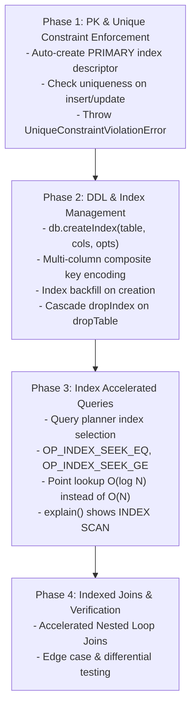

# Primary Key Enforcement & Index Activation Architecture Plan

## 1. Executive Summary & Problem Diagnosis

### 1.1 The Current Gap
Currently in WebDB:
1. **No Constraint Validation on Insertion:** `db.insert(tableName, row)` serializes rows and appends them to data leaf pages via `page_insert_row` without verifying primary key or unique constraints. Consequently, inserting duplicate primary keys succeeds silently.
2. **Full Table Scan for All Queries:** The query compiler (`compiler.ts`) unconditionally emits a full table scan loop (`OP_OPEN_CURSOR c[0]`, `OP_REWIND`, and `OP_NEXT_ROW`), even when querying exact primary keys (e.g. `.where('id', '=', 103)`).
3. **Unlinked Index Infrastructure:** While the binary disk layout on Page 1 already pre-allocates 8 fixed-size `IndexDescriptor` slots (128 bytes each, bytes `2148..3171`), and `page.c.ts` contains low-level leaf mechanics (`page_insert_index_leaf_cell`, `page_binary_search_index_leaf`), there is currently no active bridge tying table mutations and the query planner to these B+Tree indexes.

### 1.2 Objective
Activate primary key uniqueness enforcement, single-column & composite secondary B+Tree indexes, and index-accelerated point and range query execution with zero breaking changes to existing binary layouts.

---

## 2. Binary Architecture & Invariants

### 2.1 Forward-Compatible `IndexDescriptor` (Page 1)
Page 1 already reserves 8 slots $\times$ 128 bytes = 1,024 bytes (`bytes 2148..3171`) mapped to `IndexDescriptor`:
```c
typedef struct {
    uint16_t index_id;              // 1..65535 (0 = empty slot)
    uint16_t table_id;              // Owning table ID
    uint32_t root_page_id;          // Index B+Tree root Page ID (0 if unallocated)
    uint8_t  column_count;          // Number of indexed columns (1..8)
    uint8_t  flags;                 // 0x01 = UNIQUE, 0x02 = PRIMARY
    uint16_t column_indices[8];     // Column indices participating in index
    uint8_t  col_directions[8];     // Sort order per column (0 = ASC, 1 = DESC)
    char     name[64];              // Index identifier name (UTF-8, null-padded)
    uint8_t  _reserved[30];         // Reserved padding
} IndexDescriptor;                  // Exactly 128 bytes
```

### 2.2 Index B+Tree Node Types
- **Index Leaf Pages (`PAGE_TYPE_INDEX_LEAF = 0x0A`):**
  - Stores sorted entries: `[key_tuple, rowid]`.
  - Cells are ordered by SQLite 3VL collation across all composite key components.
  - Leaves maintain linked sibling pointers (`next_page_id`) for fast sequential range scans.
- **Index Interior Pages (`PAGE_TYPE_INDEX_INTERIOR = 0x02`):**
  - Stores routing cells: `[child_page_id: uint32, separator_key_tuple: bytes]`.
  - Rightmost child pointer in the 10-byte page header.

### 2.3 RowID Representation
Every record in WebDB is physically identified by a 64-bit integer `rowid` (`(page_id << 16) | slot_idx` or explicit 64-bit rowid), allowing $O(1)$ direct page fetch and slot resolution.

---

## 3. Four-Phase Implementation Roadmap



---

### Phase 1: Primary Key & Unique Constraint Enforcement (DML Guard)

#### 1.1 Automatic Primary Key Index Initialization
- In `createTable(name, columns)`:
  - If any column has `ColumnFlag.PRIMARY_KEY` (or multiple columns for composite primary key):
  - Automatically allocate an `IndexDescriptor` slot on Page 1 with:
    - `name = "pk_" + tableName`
    - `flags = IndexFlag.PRIMARY | IndexFlag.UNIQUE`
    - `column_indices = [pk_col_indices...]`
    - `root_page_id = allocateAndPinPage()` initialized as `PAGE_TYPE_INDEX_LEAF`.

#### 1.2 Insertion Verification Pipeline
In `db.insert(tableName, row)`:
1. **Not-Null Check:** Verify that primary key column(s) are not `null` or `undefined` (unless `AUTO_INC` applies).
2. **Uniqueness Probe:**
   - For each active unique index (including PK):
   - Extract key values from `row`.
   - Traverse the index B+Tree.
   - If an existing entry matches the exact key:
     ```typescript
     throw new UniqueConstraintViolationError(
       `Duplicate key value violates unique constraint "${index.name}" on table "${tableName}"`
     );
     ```
3. **Data Page Insertion:** Insert the row into the data leaf page and obtain its physical `rowid` / `(page_id, slot_idx)`.
4. **Index Entry Insertion:** Insert `(key_tuple, rowid)` into each active index B+Tree using `page_insert_index_leaf_cell`. If an index leaf fills, perform leaf split and interior node promotion.

---

### Phase 2: Index Creation & Composite Keys (DDL)

#### 2.1 Fluent DDL API
Add index management methods to `WebDB`:
```typescript
interface IndexOptions {
  unique?: boolean;
  name?: string;
}

db.createIndex(
  tableName: string,
  columns: string | string[],
  options?: IndexOptions
): Promise<void>;

db.dropIndex(indexName: string): Promise<void>;
```

#### 2.2 Composite Key Binary Encoding & Collation
- Multi-column composite keys serialized as header-prefixed tuple payloads:
  `[num_cols: uint8][col1_type: uint8][col1_len: uint16][col1_bytes]...[rowid: int64]`.
- Comparison logic:
  - Compares component by component according to respective ASC/DESC direction.
  - Follows SQLite 3VL collation: `NULL < Numbers < TEXT < BLOB`.
  - Ties broken by `rowid`.

#### 2.3 Index Backfill & Cascade Drop
- **Backfill:** When `createIndex` is executed on a table with existing rows, iterate through all data pages, extract the composite keys, check uniqueness (if `options.unique`), and insert all cells into the new index B+Tree.
- **Cascade Drop:** `dropTable` automatically locates all associated `IndexDescriptor` slots, recycles all B+Tree pages back to the free page list, and zeroes the descriptor slot on Page 1.

---

### Phase 3: Index Search & Query Acceleration (VDBE / Compiler)

#### 3.1 Query Planner Index Matching
In `compiler.ts`:
1. Inspect `plan.filters`:
   - Identify equality predicates on indexed columns (e.g. `col = val`).
   - For composite indexes: check prefix matches (`col1 = val1 AND col2 = val2`).
2. Candidate Selection:
   - Rank indexes: Primary Key > Unique Secondary > Non-Unique Secondary > Full Table Scan.
3. Path Selection:
   - **Case 1: Direct Point Seek (`OP_INDEX_SEEK_EQ`):**
     - Emits index point lookup bytecode.
     - Jumps directly to row data without traversing preceding rows or non-matching pages.
     - Complexity: $O(\log N)$ instead of $O(N)$.
   - **Case 2: Range Scan (`OP_INDEX_SEEK_GE` + `OP_INDEX_NEXT`):**
     - Seeks to lower bound, then scans index leaf sibling pointers until upper bound exceeded.
   - **Case 3: Fallback Table Scan:**
     - Used if no index covers the query predicates.

#### 3.2 VDBE Opcodes for Index Execution
Add dedicated opcodes to `OpCode` enum:
- `OP_OPEN_INDEX (0x0c)`: `[cursor_idx: uint8] [root_page_id: uint32]`
- `OP_INDEX_SEEK_EQ (0x0d)`: `[index_cursor: uint8] [data_cursor: uint8] [reg_key: uint8] [jump_not_found: uint16]`
- `OP_INDEX_SEEK_GE (0x0e)`: `[index_cursor: uint8] [reg_key: uint8] [jump_eof: uint16]`
- `OP_INDEX_NEXT (0x0f)`: `[index_cursor: uint8] [data_cursor: uint8] [jump_eof: uint16]`

#### 3.3 Explain & Diagnostics
`query.explain()` output updated to clearly reflect:
- `INDEX SCAN USING pk_users (id = ?)`
- `INDEX SCAN USING idx_users_org_created (org_id = ?, created_at >= ?)`
- `FULL TABLE SCAN users`

---

### Phase 4: Indexed Joins & Verification

1. **Indexed Nested-Loop Join Acceleration:**
   - In `customers.join('orders', 'customers.id', 'orders.customer_id')`:
   - If `orders.customer_id` is indexed, outer scan probes inner table index with $O(\log N)$ seeks instead of scanning all order pages per customer.
2. **Comprehensive Test Suite:**
   - Prevent duplicate primary key insertion.
   - Support composite primary and unique keys.
   - Verify index B+Tree splits and height expansion.
   - Benchmark point lookup speedup ($O(1)$ / $O(\log N)$ vs full scan).
   - Ensure transaction rollback correctly undoes index inserts.

---

## 4. Work Breakdown & Phasing

| Step | Tasks | Estimated Scope |
| :--- | :--- | :--- |
| **Step 1** | Add `UniqueConstraintViolationError`, auto-init PK index descriptor on `createTable`, and enforce uniqueness check on `insert()`. | Core Engine & Types |
| **Step 2** | Implement B+Tree node insertion & splitting for index pages, plus `db.createIndex()` / `db.dropIndex()`. | Storage & B+Tree |
| **Step 3** | Implement multi-column composite key serializer and comparator in `page.c.ts`. | Binary Geometry |
| **Step 4** | Update `compiler.ts` & VDBE engine to route point/range queries through index seeks instead of full scan. | Compiler & VM |
| **Step 5** | Add full unit & integration test coverage (PK violations, composite keys, explain plan verification). | Test Suite |
