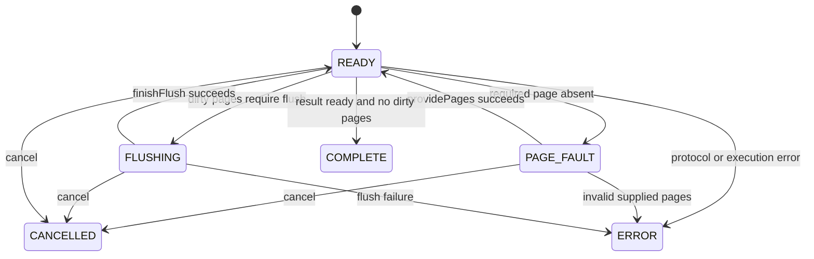

# Phase 2: Host-Driven Async Page Scheduler and Page Store

## Goal

Introduce a host-driven asynchronous page protocol for WebAssembly. The C++ core must be able to pause an operation when a required page is absent, return the required page IDs to the JavaScript host, accept supplied 4 KiB pages, and pause again when dirty pages require durable flushing.

This milestone establishes the protocol and a deterministic test implementation. It does not make the current mock SQL engine persist table data or provide transactional recovery for in-place Phase 1 page updates.

Phase 2 coordinates page reads and page-batch flushes only. Atomic publication of master metadata and recoverable commit generations remain Phase 4 work.

## Current Starting Point

- Phase 1 provides fixed-size page formats, `IPageAccessor`, dual master-page publication, and table heaps.
- `IPageAccessor` is synchronous and returns a mutable page pointer, so it cannot be exposed directly to IndexedDB.
- `wasm/bindings.cpp` exports only `SqlEngine::executeQuery`; there is no operation registry, scheduler, or JavaScript worker.
- There is no TypeScript package or browser-storage implementation in this repository yet.

## Scope

### Included

1. A C++ scheduler state machine and operation registry.
2. A resident-page cache owned by each operation, with explicit dirty tracking.
3. A host-facing WASM API for starting, stepping, supplying pages, collecting dirty pages, completing flushes, and cancellation.
4. A TypeScript protocol contract and a worker-side scheduler adapter.
5. An in-memory asynchronous page-store implementation for deterministic native and WASM protocol tests.
6. An IndexedDB page-store implementation behind the same host protocol.

### Deferred

- Shared buffer pool, eviction, pin accounting, prefetch, and concurrent-operation request deduplication. Those belong to Phase 3.
- OPFS implementation beyond a documented adapter contract.
- Query execution, catalog persistence, structured Plan IR execution, and master-page publication.
- WAL, copy-on-write data pages, and recoverable atomic DML. Phase 1 data pages remain non-transactional.

## Design Decisions

### Operation ownership

Each operation owns its resident page map and dirty-page list in Phase 2. This keeps pause/resume behavior deterministic and prevents the scheduler API from depending on the Phase 3 buffer pool.

### Fixed page validation

Every supplied page must be exactly `PAGE_SIZE` bytes. The operation validates page IDs, rejects duplicate/unrequested pages, copies host-owned bytes into WASM-owned storage, and reports `ERROR` for malformed protocol input.

### Two pause types

- `PAGE_FAULT`: the operation needs one or more absent pages. The host must call `providePages()` before stepping again.
- `FLUSHING`: the operation has dirty pages ready for persistence. The host must persist every supplied dirty page and only then call `finishFlush(success)`.

The operation never reports `COMPLETE` while dirty pages remain unflushed.

### Cancellation

Cancellation is cooperative. `cancelOperation()` transitions an active or paused operation to `CANCELLED`. Later page or flush responses for that operation are rejected and any operation-owned page memory is released.

### Commit boundary

The scheduler reports a flush set; the host owns page-batch durability. For IndexedDB, the host writes the supplied dirty pages in one `readwrite` transaction and reports success only after `transaction.oncomplete`.

Phase 2 does not expose candidate master bytes or generation IDs. Phase 4 will extend this boundary so page writes and master metadata publication form one recoverable commit protocol.

### Resource and lifecycle limits

The first implementation must define constants for maximum operation count, plan size, pending page requests, resident pages, and dirty pages per operation. Reject requests that exceed a limit before allocating additional operation memory.

Operations remain queryable in terminal states until `release_operation()` is called. Releasing an operation drops all resident pages, dirty-page snapshots, diagnostics, and result bytes. Unknown, already-released, or terminal-operation protocol calls return `INVALID_ARGUMENT` without mutating state.

## C++ API

### New types

Place scheduler types under `src/include/storage/` and implementations under `src/storage/`.

```cpp
using operation_id_t = uint64_t;

enum class SchedulerStatus : uint8_t {
    READY,
    PAGE_FAULT,
    FLUSHING,
    COMPLETE,
    CANCELLED,
    ERROR,
};

struct PageRequest {
    page_id_t page_id;
    bool is_write;
};

struct PageData {
    page_id_t page_id;
    std::vector<uint8_t> bytes; // Always PAGE_SIZE bytes.
};
```

`PageData` owns bytes at the C++ boundary so host-provided views cannot become invalid while an operation is suspended.

### Operation API

```cpp
StorageResult start_operation(std::string_view plan_json, operation_id_t& out_operation_id);
SchedulerStatus step_operation(operation_id_t operation_id);
std::vector<PageRequest> get_pending_page_requests(operation_id_t operation_id);
StorageResult provide_pages(operation_id_t operation_id, const std::vector<PageData>& pages);
std::vector<PageData> get_dirty_pages_for_flush(operation_id_t operation_id);
StorageResult finish_flush(operation_id_t operation_id, bool success);
void cancel_operation(operation_id_t operation_id);
StorageResult release_operation(operation_id_t operation_id);
std::string get_execution_results(operation_id_t operation_id);
std::string get_execution_error(operation_id_t operation_id);
```

For this milestone, `plan_json` uses a deliberately narrow, versioned test-operation format. It is not the Phase 7 Plan IR:

```json
{
  "version": 1,
  "reads": [2],
  "writes": [{"page_id": 2, "byte_offset": 64, "value": 42}]
}
```

- `reads` is the ordered set of page IDs required before writes execute.
- `writes` is optional; every write targets a page in `reads`, has `byte_offset < PAGE_SIZE`, and writes one byte.
- Duplicate IDs and unknown fields are rejected. The input has a strict maximum size and nesting depth.
- The operation requests one missing page per fault in Phase 2, while the vector API remains batch-capable for Phase 3.

### Embind wire API

Keep `PageData` as the C++ API, but do not expose `std::vector<PageData>` directly through Embind. The WASM boundary uses scalar page IDs plus byte vectors:

```cpp
std::vector<page_id_t> get_pending_page_ids(operation_id_t operation_id);
StorageResult provide_page(operation_id_t operation_id,
                           page_id_t page_id,
                           const std::vector<uint8_t>& bytes);
std::vector<page_id_t> get_dirty_page_ids(operation_id_t operation_id);
std::vector<uint8_t> copy_dirty_page(operation_id_t operation_id, page_id_t page_id);
```

The JavaScript wrapper converts between `Uint8Array` and Embind byte vectors. It checks every byte length before calling WASM and copies bytes on both sides of the boundary. Phase 2 must bind the `SchedulerStatus` enum and expose numeric operation IDs without converting them through JavaScript `number`; use Embind `BigInt` support or decimal-string operation IDs if the configured Emscripten version cannot round-trip `uint64_t` safely.

### State transitions



`step_operation()` performs at most one unit of progress: it requests one missing page, applies all validated writes, requests a flush, or completes. Invalid transitions must not mutate operation state. Examples: stepping a `PAGE_FAULT` operation before pages are supplied, supplying pages during `FLUSHING`, or finishing a flush outside `FLUSHING`.

`provide_pages()` must contain exactly the requested page IDs for the active fault. It rejects missing, extra, duplicate, wrong-sized, or negative-ID pages. `get_dirty_pages_for_flush()` returns an immutable copy of the current dirty-page snapshot; repeated calls return the same snapshot until `finish_flush()`. The operation does not allow page mutation while `FLUSHING`.

## Host Protocol

### TypeScript contract

Create a host-side package or `web/` module only after agreeing on its location. The initial public contract is:

```typescript
export interface AsyncPageStore {
  readPages(pageIds: number[]): Promise<Map<number, Uint8Array>>;
  writePages(pages: Map<number, Uint8Array>): Promise<void>;
}
```

Requirements:

- `readPages` returns independent 4096-byte page images.
- `writePages` resolves only after the backend makes the entire batch durable.
- Every input and output page is exactly 4096 bytes.
- Page IDs are signed 32-bit integers and must be non-negative when passed through JavaScript.
- The host copies page bytes before transferring them into or out of storage.

### Worker algorithm

1. Call `stepOperation()`.
2. On `PAGE_FAULT`, collect requested IDs, call `readPages`, verify every requested ID is present, then call `providePages()`.
3. On `FLUSHING`, collect the dirty-page snapshot and call `writePages()`.
4. Call `finishFlush(operationId, true)` only after `writePages()` resolves. On rejection, call `finishFlush(operationId, false)`.
5. Continue until `COMPLETE`, `CANCELLED`, or `ERROR`.

No response may be delivered after cancellation.

The coordinator must use a single in-flight host request per operation. It checks cancellation again after every `await` and before `provide_page()` or `finish_flush()`. Storage exceptions are translated to `finish_flush(id, false)` for flushes; read exceptions set the operation to `ERROR` through a dedicated `fail_operation(id, message)` API.

## Build and Test Tooling

- Add scheduler sources to `webdb_core` so native unit tests and the WASM module use identical C++ code.
- Add a native CTest executable for scheduler and in-memory async-store tests.
- Create `web/` with `package.json`, `tsconfig.json`, and a browser-capable test runner before adding the IndexedDB adapter. Use fake IndexedDB only for unit-level transaction failure tests; run at least one integration test in a real browser engine.
- Add Make targets for the browser test command only after the JavaScript package exists. Keep `make test` as the native-only suite until then.
- Pin the Emscripten and Node.js versions used for WASM and browser tests in project documentation or CI configuration.

## Implementation Sequence

### Step 1: Scheduler lifecycle foundation

**Purpose:** Establish a bounded C++ operation registry before introducing page I/O or parsing.

**Implement:**

- `operation_id_t`, `SchedulerStatus`, `PageRequest`, `PageData`, and resource-limit constants.
- `OperationScheduler` creation, lookup, cancellation, terminal-state retention, diagnostics, and explicit release.
- `start_operation()` accepts an opaque byte string only for this step. It checks the plan-size limit and copies the input into scheduler-owned memory.
- `step_operation()` transitions `READY` directly to `COMPLETE` with a placeholder result. This proves lifecycle behavior without pretending to execute the future test-operation format.
- Page fault, page supply, dirty-page collection, flush completion, JSON validation, and Embind exports remain unimplemented and reject unsupported calls deterministically.

**Tests:** operation-ID uniqueness, plan-size and operation-count limits, cancellation, terminal result retention, release rules, unknown IDs, and invalid transition rejection.

**Exit gate:** Native unit tests pass. No public WASM or JavaScript API is promised yet.

### Step 2: Per-operation resident-page cache

**Purpose:** Add deterministic page faults and safe page delivery while retaining one-operation ownership.

**Implement:**

- Resident-page map and a single pending page request per operation.
- `READY -> PAGE_FAULT` when an operation needs an absent page; `PAGE_FAULT -> READY` only after the expected page is supplied.
- Strict page validation: requested non-negative ID, exactly `PAGE_SIZE` bytes, no duplicate, missing, or unexpected response.
- Copy supplied bytes into scheduler-owned memory. The host retains no alias to resident page memory.
- Preserve the vector API even though this step produces one missing-page request at a time.

**Tests:** fault/resume transitions, wrong-sized and wrong-ID pages, duplicate/missing responses, source-buffer mutation after supply, cancellation during a fault, and resident-page limits.

**Exit gate:** An in-memory C++ caller can request, supply, and subsequently access a page without asynchronous or WASM tooling.

### Step 3: Versioned test-operation parser and mutation flow

**Purpose:** Exercise the full scheduler loop without introducing the Phase 7 query language.

**Implement:**

- Parse only the documented version-1 `reads`/`writes` test-operation JSON format.
- Reject malformed JSON, unknown fields, duplicate IDs, invalid page IDs, invalid byte offsets, out-of-range byte values, excessive nesting, and writes targeting pages absent from `reads`.
- Change `step_operation()` to request required pages in order, apply validated single-byte writes, mark changed pages dirty, enter `FLUSHING`, then complete after a successful flush.
- Build a stable dirty-page snapshot. No mutation is allowed while `FLUSHING`.

**Tests:** parser rejection matrix, read order, one fault at a time, writes changing only the target byte, dirty-page deduplication, snapshot stability, and `finish_flush(false) -> ERROR` diagnostics.

**Exit gate:** A native test completes `PAGE_FAULT -> provide_pages -> FLUSHING -> finish_flush(true) -> COMPLETE` for a valid test operation.

### Step 4: Durable in-memory async page store

**Purpose:** Separate volatile host buffers from a durable store image so tests can model a restart honestly.

**Implement:**

- Test-only `AsyncPageStore` with independent copies for reads, pending writes, and durable pages.
- Batch writes that either fully replace the durable image or fail without changing it.
- Fresh-store/restart constructor that exposes only durable state.

**Tests:** successful flush, rejected flush, durable-image immutability after caller buffer changes, restart visibility, and multi-page batch behavior.

**Exit gate:** Native integration tests prove scheduler/host page flushing without claiming recovery of torn data-page writes.

### Step 5: Embind scheduler boundary

**Purpose:** Expose the tested C++ protocol to JavaScript without raw pointers or unsafe integer conversion.

**Implement:**

- Bind `SchedulerStatus` and scalar scheduler operations.
- Use the explicit page wire API: page-ID vectors plus a single page ID and byte vector for transfer.
- Verify whether the configured Emscripten version round-trips `uint64_t` as `BigInt`; otherwise use decimal-string operation IDs.
- Reject non-4096-byte `Uint8Array` values in the JavaScript wrapper before crossing into WASM.

**Tests:** `make wasm` builds the bindings; a WASM smoke test creates, steps, cancels, releases, and transfers a page through the wrapper.

**Exit gate:** The browser-facing protocol has the same state and validation semantics as native tests.

### Step 6: TypeScript worker coordinator and in-memory host

**Purpose:** Implement the real asynchronous control loop with a testable host before relying on IndexedDB.

**Implement:**

- Create `web/` with pinned Node.js tooling, TypeScript configuration, and an `AsyncPageStore` interface.
- Implement the normal `async` worker loop: step, read on `PAGE_FAULT`, write on `FLUSHING`, then resume.
- Enforce one in-flight host request per operation and re-check cancellation after every `await`.
- Translate read failures to `fail_operation()` and write failures to `finish_flush(id, false)`.

**Tests:** end-to-end worker flow against the in-memory host, cancellation while awaiting read/write, late-response rejection, and host exception propagation.

**Exit gate:** A TypeScript test drives a compiled WASM operation through page fault, mutation, flush, and completion.

### Step 7: IndexedDB page store

**Purpose:** Persist Phase 2 page batches in the universal browser backend.

**Implement:**

- Add `webdb_pages`, keyed by signed 32-bit page ID, whose values are copied 4096-byte `Uint8Array` images.
- Run each `writePages()` batch in one IndexedDB `readwrite` transaction.
- Resolve only after `transaction.oncomplete`; reject on `abort` or `error`.
- Keep `webdb_meta`, master-page publication, generation advancement, and recoverable atomic commits out of scope until Phase 4.

**Tests:** fake-IndexedDB unit tests for validation and transaction errors, plus real-browser tests for completion, abort, copied pages, and cancellation after awaits.

**Exit gate:** IndexedDB failures surface through the worker as scheduler errors, and successful flushes survive an IndexedDB reopen.

## Test Plan

### C++ unit tests

- Valid state transitions for each scheduler status.
- Invalid transitions preserve state and return a deterministic error.
- Missing-page request deduplication within one operation.
- Reject wrong-sized pages, unexpected IDs, duplicate IDs, and null/empty page batches.
- Supplied pages are copied; mutating the host buffer after supply does not change the resident page.
- Dirty-page collection contains each dirty page once, returns a stable snapshot, and does not clear it before successful `finishFlush`.
- Failed flush transitions to `ERROR` and does not claim completion.
- Cancellation works from `READY`, `PAGE_FAULT`, and `FLUSHING`; late host responses are rejected.
- Operation IDs remain unique and unknown IDs return `INVALID_ARGUMENT`.
- Releasing terminal operations frees their state; releasing nonterminal operations is rejected or explicitly defined as cancellation followed by release.
- Embind page-transfer tests reject IDs outside the signed 32-bit range and byte arrays whose length differs from `PAGE_SIZE`.

### Durability simulation tests

Use the test-only async page store with separate volatile and durable images:

- A successful flush persists every dirty page to the durable image.
- A rejected flush leaves the durable image unchanged.
- A fresh store instance reads only the durable image.
- Page values supplied to, or returned from, the store cannot mutate the durable image by aliasing.

These tests establish host page-flush behavior only. They must not claim atomic multi-page recovery or recovery of torn Phase 1 data-page writes.

### Browser tests

- IndexedDB `readPages` returns exact 4096-byte copies.
- `writePages` resolves only after `oncomplete`.
- Transaction abort rejects the operation and leaves the prior page values readable.
- Worker cancellation drops late read/commit responses.
- A real browser test verifies that `Uint8Array` pages are copied rather than retained as aliases across the WASM and IndexedDB boundaries.

## Acceptance Criteria

Phase 2 is complete when:

1. Native tests cover scheduler state transitions, invalid protocol inputs, cancellation, and durable-image recovery behavior.
2. The WASM module exports the scheduler operations and can complete a page fault/flush/resume flow with a test host.
3. The worker host can read and flush page batches through IndexedDB, awaiting transaction completion.
4. A failed IndexedDB transaction is surfaced as `ERROR` and does not alter the test store's durable image.
5. Every operation is explicitly released after observing its terminal result or error.
6. Documentation states clearly that Phase 2 does not make Phase 1 in-place data-page mutations recoverable; Phase 4 provides that stronger guarantee.

## Open Decisions for Review

1. Should Phase 2 include a minimal executable operation format, or should the scheduler remain a standalone test API until the Phase 7 Plan IR exists?
Answer: Use the versioned read/write test-operation format defined above. It proves the full fault, supply, mutation, and flush flow without becoming a premature query language.

2. Should the browser host live in this repository under `web/`, or in a separate `@webdb/client` repository/package?
Answer: for now inside a `web/` folder

3. Should an operation request pages one at a time initially, or should the C++ API permit multi-page faults from day one?
Answer: Keep the vector-based API from day one, but issue one page request per fault initially. Phase 3 can add multi-page faults and prefetching without breaking the protocol.


4. Does Phase 2 need to expose candidate master-page bytes explicitly, or should master publication remain a scheduler-private operation until catalog support exists?
Answer: Defer candidate master bytes and all master metadata publication to Phase 4. Phase 2 flushes page batches only.
