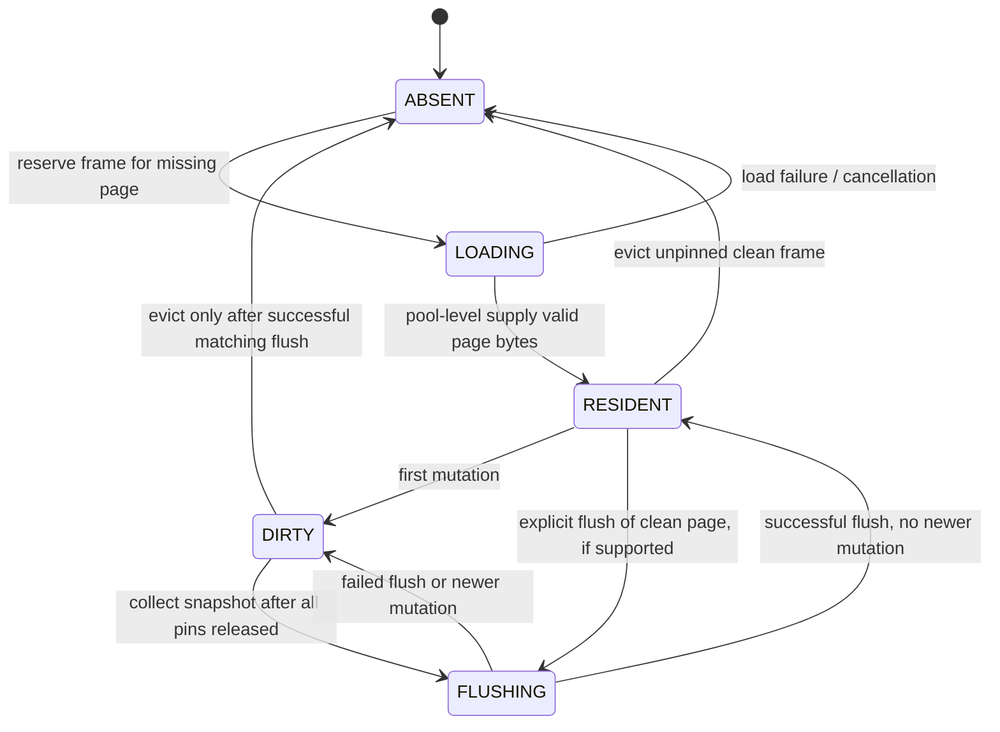

# Phase 3: Buffer Pool Manager with Async I/O Awareness

## Goal

Introduce a shared, bounded buffer pool for native and WebAssembly execution. The buffer pool owns a fixed number of 4 KiB frames, tracks page residency and dirty state, preserves pins while an operation is suspended on host I/O, and evicts only safe unpinned pages through a scan-resistant replacement policy.

This milestone replaces Phase 2's per-operation resident-page ownership with shared page frames. It does not make page updates transactional or publish master metadata; atomic page-plus-master commits remain Phase 4 work.

## Current Starting Point

- Phase 1 defines fixed-size pages, page IDs, page validation, `IPageAccessor`, table pages, and table heaps.
- Phase 2 provides a host-driven scheduler with per-operation resident pages, page faults, dirty-page snapshots, flush completion, cancellation, and IndexedDB page batches.
- The Phase 2 scheduler can have multiple operations, but each operation currently owns its own page copies. There is no shared frame table, pin count, replacement policy, or in-flight load deduplication.
- The browser coordinator allows one host request per operation. The host page-store contract already supports batched reads and writes.

## Scope

### Included

1. A shared `BufferPoolManager` with a fixed frame budget.
2. Explicit frame states and ownership rules for loading, resident, dirty, and flushing pages.
3. Pin and unpin operations that remain correct across scheduler pauses and resumes.
4. A scan-resistant Clock or equivalent second-chance replacement policy.
5. Deduplication of concurrent requests for the same page within the buffer pool.
6. Batch page-fault and dirty-page collection APIs for the shared buffer-pool host protocol.
7. Native tests, scheduler integration tests, and browser-facing protocol tests for the new behavior.

### Deferred

- Atomic master-page publication, generation advancement, WAL, and crash recovery. These belong to Phase 4.
- Durable free-list allocation, page-count publication, and catalog persistence beyond the interfaces needed by the buffer pool.
- Prefetch heuristics beyond explicit batch requests. Sequential scan prefetch policy is introduced with scan executors.
- OPFS-specific I/O and backend selection.
- Query execution, Plan IR, indexes, and transaction isolation.

## Design Decisions

### Shared ownership

The buffer pool is the single owner of resident page bytes. Operations receive guarded access to frames rather than owning independent copies. A frame cannot be evicted while any operation holds a pin or while a host load or flush is in flight.

### Page identity

There is at most one frame for a given `page_id_t`. A lookup either returns the resident frame, joins an existing load request, or allocates a frame and starts a new page fault. Duplicate requests must never create two mutable copies of the same page.

### Result codes and cache misses

Phase 3 continues to use `StorageResult` for C++ buffer-pool results. Existing numeric values remain stable. Add these explicit values:

```cpp
BUFFER_FULL = 10,
PAGE_NOT_RESIDENT = 11,
LOAD_IN_PROGRESS = 12,
BUSY = 13,
FLUSH_REQUIRED = 14,
```

`BUFFER_FULL` means no frame can currently be reserved. `PAGE_NOT_RESIDENT` means a page miss registered a load and the caller must yield. `LOAD_IN_PROGRESS` means the caller joined an existing load. `BUSY` means a page is flushing or otherwise temporarily unavailable. `FLUSH_REQUIRED` means the requested page cannot be pinned until the returned dirty candidates are flushed; it is a resumable memory-pressure condition, not terminal out-of-memory.

The shared C++ type definitions must add the matching explicit constants:

```cpp
inline constexpr page_id_t MAX_DATA_PAGE_ID =
    std::numeric_limits<page_id_t>::max();
```

The header must include `<limits>` for this definition.

Define `MAX_DATA_PAGE_ID` once in `src/include/common/types.hpp` as the maximum non-negative `page_id_t` value, and use that symbol for buffer-pool validation. The TypeScript layer mirrors the same numeric maximum in its protocol constants. Do not duplicate a different range in the scheduler, WASM bridge, or page store.

Only `BUFFER_FULL` and other results needed by the public WASM adapter are exposed in `bindings.cpp` and `web/src/protocol.ts`, with explicit numeric values. `SchedulerStatus::PAGE_FAULT` remains the scheduler-level signal; it is not reused as a storage result.

### Frame states

Each frame has one state and a stable page identity while it is pinned:

- `ABSENT`: no page is assigned to the frame.
- `LOADING`: the frame is reserved for a page and awaits host-supplied bytes. It is pinned and cannot be reused.
- `RESIDENT`: the page is valid and clean. It may be read or pinned.
- `DIRTY`: the page is modified and must be included in a future flush. It remains resident and cannot be evicted while pinned.
- `FLUSHING`: a stable copy is being written by the host. The frame is pinned against overwrite; new writes to the same page are rejected or deferred until the flush completes.

The implementation may represent clean and dirty status as separate flags internally, but the externally observable transitions must follow this model.

### Pin accounting

Pins are owned by logical operation handles, not by transient C++ stack scopes alone. A page requested before a scheduler yield remains pinned until the operation either consumes the page, explicitly unpins it, is cancelled, or reaches a terminal state. Cancellation and release must unwind all pins owned by that operation exactly once.

### Replacement policy

Use a Clock policy for the first implementation, with a reference bit set on every successful pin or access. The hand skips pinned, loading, flushing, and recently referenced frames. An unpinned frame with its reference bit set receives a second chance: the bit is cleared and the hand advances. Candidate selection is bounded to at most `2 * frame_count` inspections. `BUFFER_FULL` is returned only after no safe victim is found; a sweep may change reference bits while making this determination.

The policy must be scan-resistant enough that a sequential workload can be tested without evicting permanently pinned hot pages. A later 2Q policy can replace Clock behind the same interface if benchmarks show a need.

### Dirty-page safety

Dirty bytes are not cleared when a flush snapshot is collected. A successful flush clears the dirty state only if the frame still represents the same page and its current mutation generation equals the snapshot generation. A failed flush keeps the frame dirty. A frame cannot be reused while its snapshot is in `FLUSHING`.

The first implementation requires all active pins to be released before a dirty frame enters `FLUSHING`. `PageHandle::bytes` is valid only while its pin token is active; stale handles must not be used after unpinning. Flush data is copied into an isolated snapshot before host I/O, so host storage never aliases frame memory. A mutation after snapshotting is represented by a newer dirty generation and cannot be cleared by the older flush result.

When memory pressure finds only unpinned dirty candidates, `pin_page()` returns `FLUSH_REQUIRED` and records a bounded dirty-pressure batch. It does not block, flush internally, or return `SUCCESS`. The scheduler transitions the operation to `FLUSHING`, yields that batch to the host, and retries the original pin only after every matching flush completes successfully. If the flush fails, the pages return to `DIRTY`, the active batch is cleared, and the requesting operation enters `ERROR`; if no flush can be started within configured limits, `pin_page()` returns `BUFFER_FULL`.

Phase 3 does not claim atomic durability across multiple pages. A host may still persist a page batch independently; Phase 4 adds the generation and master-page protocol needed for recoverable commits.

## C++ API

Place the public types under `src/include/storage/` and implementations under `src/storage/`. The scheduler uses the buffer pool as its sole page owner; page supply is pool-level and is not routed through the Phase 2 operation-owned resident-page API.

```cpp
enum class BufferFrameState : uint8_t {
    ABSENT,
    LOADING,
    RESIDENT,
    DIRTY,
    FLUSHING,
};

using frame_id_t = uint32_t;
using pin_token_t = uint64_t;

struct BufferPoolConfig {
    uint32_t frame_count;
    uint32_t max_pending_loads;
    uint32_t max_flush_batch_pages;
};

// Native tests and the scheduler adapter inspect these descriptors; mutable frame
// storage remains private to BufferPoolManager.
struct FrameDescriptor {
    frame_id_t frame_id{0};
    page_id_t page_id{INVALID_PAGE_ID};
    BufferFrameState state{BufferFrameState::ABSENT};
    uint32_t pin_count{0};
    bool ref_bit{false};
    uint64_t dirty_generation{0};
    uint64_t flushing_generation{0};
};
```

```cpp
struct PageHandle {
    page_id_t page_id;
    frame_id_t frame_id;
    pin_token_t pin_token;
    uint8_t* bytes;
};
```

Internally, the manager maintains a pin-token map from `(operation_id_t, pin_token_t)` to `frame_id_t`, a waiter registry from loading `page_id_t` to operation IDs, and stable contiguous storage such as `std::unique_ptr<uint8_t[]>` sized to `frame_count * DATABASE_PAGE_SIZE`. Frame addresses therefore remain stable for the lifetime of the pool.

The exact names may follow local C++ style, but the ownership and result semantics below are required:

```cpp
StorageResult pin_page(operation_id_t operation_id,
                       page_id_t page_id,
                       PageHandle& out_handle);
StorageResult new_page(operation_id_t operation_id,
                       page_id_t expected_page_id,
                       PageHandle& out_handle);
StorageResult unpin_page(operation_id_t operation_id,
                         pin_token_t pin_token,
                         bool is_dirty);
StorageResult mark_page_dirty(operation_id_t operation_id,
                              pin_token_t pin_token);
StorageResult release_operation_pins(operation_id_t operation_id);

std::vector<page_id_t> get_pending_page_ids() const;
StorageResult provide_page(page_id_t page_id,
                           const std::vector<uint8_t>& bytes,
                           std::vector<operation_id_t>& out_woken_operations);
StorageResult abort_page_load(page_id_t page_id,
                              std::vector<operation_id_t>& out_failed_operations);
struct FlushPage {
    page_id_t page_id{INVALID_PAGE_ID};
    uint64_t generation{0};
    std::vector<uint8_t> bytes;
};
using flush_batch_id_t = uint64_t;
struct FlushBatch {
    flush_batch_id_t batch_id{0};
    std::vector<FlushPage> pages;
};
FlushBatch get_active_flush_batch();
StorageResult finish_page_flush(flush_batch_id_t batch_id,
                                page_id_t page_id,
                                uint64_t flushing_generation,
                                bool success);
```

`pin_page()` has an explicit miss contract. For a resident page it returns `SUCCESS` and fills `out_handle`. For an absent page it reserves a frame, registers the operation as a waiter, leaves `out_handle` unchanged, and returns `PAGE_NOT_RESIDENT`; the scheduler converts this to `PAGE_FAULT`. For a page already loading, it registers another waiter, leaves `out_handle` unchanged, and returns `LOAD_IN_PROGRESS`. When only unpinned dirty victims are available, it records the flush batch, leaves `out_handle` unchanged, and returns `FLUSH_REQUIRED`. It returns `BUFFER_FULL` only when no frame can be reserved and no dirty-pressure flush can be started. No failed call modifies `out_handle`.

`new_page()` accepts an `expected_page_id` selected by the caller's page-allocation authority, reserves a frame without a host read, zero-initializes exactly one page, marks it `DIRTY` with `dirty_generation = 1`, and returns a pinned handle. It rejects an ID outside `0..MAX_DATA_PAGE_ID` or an ID that is already resident, loading, or flushing. It does not validate page-count sequencing because authoritative allocation remains outside the buffer pool until catalog/page-count work is implemented. The API exists so callers never attempt to read a new page from the host.

`get_active_flush_batch()` creates one `FlushBatch` identity when no batch is active and records each page's `flushing_generation` alongside its isolated page copy. Repeated reads return the same immutable batch. `finish_page_flush()` must receive the batch ID, page ID, and generation; it rejects stale, duplicate, or cross-batch completions without changing frame state. A successful batch is complete only after every page receives a matching completion. A failed completion returns every page in the batch to `DIRTY`, clears the active batch, and makes a later batch collectable. `abort_page_load()` transitions the matching frame to `ABSENT`, clears its waiter registry, and reports waiters with the host error; it is idempotent only for an already-cleared load.

At most one `FlushBatch` may be active in the buffer pool. `get_active_flush_batch()` records its `batch_id` as the active flush and transitions its pages to `FLUSHING`. Any subsequent collection or dirty-pressure request while that batch is active returns `BUSY` and leaves the existing batch unchanged. A successful batch clears only after every page receives a matching completion; a failed completion clears the batch and returns all affected frames to `DIRTY`.

`provide_page()` and `abort_page_load()` return the affected operation IDs through their output vectors. The buffer pool does not mutate scheduler state directly; the scheduler uses those vectors to transition waiting operations to `READY` or `ERROR` and to remove cancelled waiters.

The buffer pool must expose inspection methods for native tests: frame state, page ID, pin count, reference bit, dirty generation, and pending load/flush membership. These diagnostics must not expose mutable frame internals through the browser API.

The native inspection contract is:

```cpp
size_t frame_count() const noexcept;
size_t resident_count() const noexcept; // RESIDENT, DIRTY, or FLUSHING
size_t dirty_count() const noexcept;
size_t loading_count() const noexcept;
size_t flushing_count() const noexcept;
size_t free_frame_count() const noexcept;

frame_id_t get_clock_hand() const noexcept;
std::optional<frame_id_t> find_frame_by_page_id(page_id_t page_id) const noexcept;
std::optional<FrameDescriptor> get_frame_descriptor(frame_id_t frame_id) const noexcept;
bool is_page_resident(page_id_t page_id) const noexcept;
bool is_page_loading(page_id_t page_id) const noexcept;
uint32_t get_pin_count(page_id_t page_id) const noexcept;
```

`get_frame_descriptor()` returns `std::nullopt` for an invalid frame ID. `find_frame_by_page_id()` excludes `ABSENT` frames and returns at most one frame because duplicate residency is an invariant.

## State Transitions



Invalid transitions must preserve state and return a deterministic error. In particular, a loading page cannot be supplied twice, page supply is pool-level rather than operation-level, a flushing frame cannot be modified through an old pin, and a pinned frame cannot be evicted.

## Scheduler Integration

### Operation-to-buffer-pool contract

1. The scheduler asks the buffer pool to pin a page for the current operation.
2. If the page is resident, the scheduler continues without a host request.
3. If the page is loading, the scheduler yields `PAGE_FAULT` with the shared pending page ID.
4. The host supplies each page once through the buffer-pool/scheduler shared-load adapter. The adapter returns all woken operation IDs, and every non-cancelled waiter may resume. No operation-level page-supply API exists in Phase 3.
5. A woken operation transitions to `READY` and retries its original `pin_page()` request; page supply itself does not create or return operation pin handles.
6. If another operation encounters an active flush batch, its pin attempt returns `BUSY`. The scheduler keeps its original pin request as a retry marker and retries it after the active batch completes or fails; it does not create another flush batch.
7. The operation unpins pages at the earliest point its execution contract permits. Long-lived catalog or transaction pins remain explicit.
8. On cancellation or release, the scheduler releases all operation-owned pin tokens before dropping the operation.

### Batch faults

The C++ side may report multiple pending page IDs in one fault. The host reads them in one `readPages()` call, validates that every requested ID is present and correctly sized, then supplies each page through the shared-load adapter. A single failed or cancelled batch calls `abort_page_load()` for each still-loading page and must not leave a frame in `RESIDENT` with uninitialized bytes. The TypeScript coordinator must accept any non-empty pending-ID list, supply every page through the pool-level bridge, and preserve cancellation checks between awaits and supplies.

### Shared host coordination

Concurrent operations share one host coordinator service, not separate read-deduplication maps inside individual `runOperation()` calls. The service maintains an in-flight map keyed by page ID (or a sorted page-ID batch key) and shares one `Promise<Uint8Array | undefined>` with all operations requesting the same page. Only the service that owns the in-flight request calls pool-level `providePage()`; all waiters consume the resulting wakeup IDs. A resident-page duplicate supply is rejected by the normal protocol; matching-page idempotence may be implemented as a defensive bridge safeguard but is not the coordination mechanism.

The Phase 3 TypeScript bridge is pool-oriented:

```typescript
export interface FlushPageSnapshot {
    readonly pageId: number;
    readonly generation: bigint;
    readonly bytes: Uint8Array;
}

export interface SchedulerBridge {
    startOperation(plan: string): string;
    lastStartResult(): StorageResult;
    stepOperation(operationId: string): SchedulerStatus;
    getPendingPageIds(operationId: string): readonly number[];

    providePage(pageId: number, bytes: Uint8Array): readonly string[];
    abortPageLoad(pageId: number): readonly string[];

    getActiveFlushBatch(): {
        readonly batchId: bigint;
        readonly pages: readonly FlushPageSnapshot[];
    };
    finishPageFlush(batchId: bigint, pageId: number, generation: bigint, success: boolean): StorageResult;

    cancelOperation(operationId: string): void;
    releaseOperation(operationId: string): StorageResult;
    getExecutionResults(operationId: string): string;
    getExecutionError(operationId: string): string;
}
```

The bridge exposes one immutable active flush snapshot through `getActiveFlushBatch()`, containing the batch ID and all page snapshots. `finishPageFlush()` validates the batch ID and generation. `providePage()` and `abortPageLoad()` return the operation IDs awakened or failed by the pool; the coordinator uses those IDs to resume or fail operations without guessing from local state. Flush snapshots are global to the buffer pool, not owned by an individual operation.

### Flush coordination

The buffer pool returns one stable `FlushBatch` and generation token per flush request. The host coordinator owns the batch until all pages are written and each matching `finish_page_flush(batch_id, page_id, generation, true)` succeeds. On a write failure, it reports failure once for the batch; the pool returns all batch pages to `DIRTY` and clears the active batch. It does not expose mutable frame memory to the host. The first implementation requires all pins to be released before `FLUSHING`; new pins while flushing return `BUSY` and old handles are invalid after unpin. This avoids permitting a raw `PageHandle::bytes` pointer to mutate a page during host I/O.

## Resource and Error Policy

- `frame_count` must be nonzero and bounded by a configured maximum before allocation.
- `frame_count` is configurable in native tests and passed through the scheduler adapter; the WASM wrapper exposes a bounded constructor/configuration path for deterministic two-to-four-frame eviction tests.
- Buffer-pool page IDs are valid signed non-negative IDs from `0` through `MAX_DATA_PAGE_ID`, including master pages 0 and 1. Operation-plan parsing remains stricter and accepts only data page IDs from `FIRST_DATA_PAGE_ID` through `MAX_DATA_PAGE_ID`.
- Every loading or flushing frame consumes one pending-I/O slot until completion or cancellation.
- A failed load calls `abort_page_load()`, releases the reserved frame, and reports all failed waiter IDs without exposing invalid data.
- A failed flush retains dirty bytes and reports the page as retryable; it must not silently mark the frame clean.
- `FLUSH_REQUIRED` is resumable and distinct from `BUFFER_FULL`, `IO_ERROR`, `INVALID_ARGUMENT`, and `CANCELLED`.
- `BUSY` is also resumable: the operation retains its original pin request and retries after the active flush batch is cleared.
- Releasing an operation with outstanding pins is either rejected or performs an idempotent cancellation-and-unpin sequence; choose one behavior and test it consistently.
- Allocation failures must leave the frame table and replacement hand unchanged.

## Implementation Sequence

### Step 1: Frame table and lifecycle foundation

**Purpose:** Establish bounded frame allocation and observable state transitions for the new shared scheduler path.

**Implement:**

- `BufferPoolConfig`, frame records, page-to-frame lookup, and frame-to-page reverse lookup.
- `FrameDescriptor`, private contiguous frame storage, the pin-token registry, and the loading-page waiter registry.
- An `ABSENT`-frame free list checked before any replacement-policy sweep.
- `ABSENT`, `LOADING`, `RESIDENT`, `DIRTY`, and `FLUSHING` transitions.
- Configuration and resource-limit validation before allocating frames.
- Explicit `StorageResult` values for `BUFFER_FULL`, `PAGE_NOT_RESIDENT`, `LOAD_IN_PROGRESS`, `BUSY`, and `FLUSH_REQUIRED`, preserving existing numeric values.
- Native-only inspection methods and deterministic errors.
- A minimal test backend that supplies pages synchronously to exercise the frame table.

**Tests:** frame-count limits, page identity uniqueness, invalid transitions, failed allocation rollback, and exact frame-state diagnostics.

**Exit gate:** Native tests can create a bounded pool and prove that one page ID never has two resident frames.

### Step 2: Pin tokens and operation ownership

**Purpose:** Make page lifetime explicit and safe across asynchronous pauses.

**Implement:**

- Pin tokens associated with an operation ID.
- Pin-count increments and decrements with underflow/foreign-token rejection.
- Dirty marking on unpin and explicit mark-dirty calls.
- Idempotent cancellation/release cleanup for all pins owned by an operation.
- Protection against eviction and overwrite while a frame is pinned.

**Tests:** multiple pins, cross-operation pins, duplicate unpin, cancellation from each frame state, release cleanup, and pinned-frame eviction rejection.

**Exit gate:** A suspended operation can retain a page across an arbitrary host await without the page being reused or mutated by eviction.

### Step 3: Clock replacement and clean eviction

**Purpose:** Reclaim bounded memory without evicting active or recently used pages.

**Implement:**

- Clock hand and per-frame reference bit.
- Candidate selection that skips pinned, loading, and flushing frames; unpinned dirty candidates initiate a bounded flush request before eviction.
- Free-frame precedence: consume an `ABSENT` frame before considering Clock eviction.
- Second-chance behavior for recently referenced resident pages.
- Clean eviction and frame reuse with no stale page-map entries.
- A maximum `2 * frame_count` hand sweep, with reference bits cleared during the first chance pass.
- Deterministic `BUFFER_FULL` when all frames are protected or dirty flushing cannot be started.

**Tests:** hand advancement, second chances, clean eviction, hot-page retention during scans, stale lookup prevention, and all-frames-protected behavior.

**Exit gate:** A bounded pool survives a working-set larger than its frame count while preserving pinned pages and returning deterministic failure when no safe victim exists.

### Step 4: Async page loading and request deduplication

**Purpose:** Connect shared frames to the Phase 2 host-driven page protocol.

**Implement:**

- `ABSENT -> LOADING` reservation and pending page-ID collection.
- Joining of multiple operation requests for the same loading page.
- Pool-level page supply and `abort_page_load()`; operation-owned `providePage()` is not used to supply a shared load twice.
- Return woken and failed operation IDs so `OperationScheduler` can update its own state map.
- Exact-size and exact-ID validation for supplied page bytes.
- Copying host bytes into the reserved frame and waking all non-cancelled waiters.
- Load failure and cancellation cleanup that returns the frame to `ABSENT`.
- Batch `readPages()` integration in the TypeScript coordinator.

**Tests:** duplicate page requests produce one host read, shared load completion wakes all waiters, malformed batches leave no resident garbage, cancellation of one waiter does not cancel other waiters, and failed loads are retryable.

**Exit gate:** Two operations requesting the same absent page share one load and both receive the same buffer-pool-owned page image.

### Step 5: Dirty tracking and flush snapshots

**Purpose:** Flush shared dirty frames without losing mutations or exposing aliases.

**Implement:**

- Dirty generation or mutation sequence per frame.
- Stable flush snapshots containing page ID, bytes, and snapshot generation.
- `DIRTY -> FLUSHING` collection only after all active pins are released.
- Successful completion that clears dirty state only when no newer mutation exists.
- Failed completion that returns the frame to `DIRTY`.
- Dirty-pressure eviction flow: request a flush, await host completion, then retry victim selection.
- Batch-size limits and deterministic ordering for dirty-page collection.

**Tests:** dirty deduplication, snapshot immutability, caller-buffer isolation, mutation during or after snapshot, successful flush, failed flush, retry, and mixed success/failure batches.

**Exit gate:** A failed flush never loses a dirty page, and a mutation after snapshot cannot be accidentally cleared by an older flush result.

### Step 6: Scheduler migration and cancellation integration

**Purpose:** Make the shared buffer pool the sole page owner for scheduler operations.

**Implement:**

- Replace per-operation resident-page maps with buffer-pool handles; remove the operation-owned resident-page and page-supply paths.
- Convert cache-miss results into scheduler `PAGE_FAULT` states without exposing `PAGE_NOT_RESIDENT` as a scheduler status.
- Convert `FLUSH_REQUIRED` into scheduler `FLUSHING` with a retry marker for the original pin request. After successful host flush completion, return to `READY` and retry the pin.
- Preserve `PAGE_FAULT`, `FLUSHING`, `COMPLETE`, `CANCELLED`, and `ERROR` semantics for the shared-pool path.
- Release all operation pins on terminal completion, cancellation, and explicit release.
- Expose pool-level dirty snapshots and generation tokens through the new Embind adapter.
- Ensure late page supplies and flush completions cannot affect released operations.
- Route shared page supply and load aborts through the pool-level adapter, waking all non-cancelled waiters exactly once.
- Migrate `tests/test_operation_scheduler.cpp`: retain parser and lifecycle coverage, remove operation-owned resident-page tests, and add pool-level supply, waiter wakeup/abort, flush-batch identity, generation validation, and shared ownership coverage.

**Tests:** existing Phase 2 scheduler suite, multi-operation shared pages, cancellation during load and flush, release with pins, invalid late responses, and operation isolation.

**Exit gate:** The full native scheduler suite passes with shared frame ownership and no public protocol regression.

### Step 7: Browser host integration and stress coverage

**Purpose:** Verify that the new shared ownership model is correct across the WASM and IndexedDB boundaries.

**Implement:**

- Update the TypeScript bridge for batched pending IDs, pool-level page supply, dirty-page snapshots, flush-batch identity, and flush-required retries.
- Update `operation-coordinator.ts` and its shared host service to accept non-empty batches, deduplicate in-flight reads across concurrent operations, supply every page through the pool-level bridge, and abort every still-loading page on read failure.
- Keep page copying and signed 32-bit page-ID validation at every boundary.
- Exercise concurrent operations through the coordinator with a single backend store.
- Add a bounded frame-count configuration path through the WASM wrapper for deterministic two-to-four-frame eviction tests.

**Tests:** Node coordinator tests for shared reads and cancellation, fake-IndexedDB batch behavior, Chromium tests for persistence after eviction and retry after aborted flush, and stress tests with more logical pages than frames.

**Exit gate:** Native, WASM, Node, and browser tests demonstrate bounded memory, shared page loads, safe eviction, and correct flush retry behavior.

## Test Plan

### C++ unit tests

- Frame-state transitions and invalid-transition preservation.
- One-frame-per-page invariant.
- Inspection API semantics: resident counts include `RESIDENT`, `DIRTY`, and `FLUSHING`; loading/flushing counts and free-frame counts remain consistent.
- Explicit result-code values and cache-miss contracts, including unchanged output handles on failure.
- Zero-initialized new-page allocation without a host read.
- New pages begin `DIRTY` and cannot be evicted before a matching successful flush.
- Pin-token ownership, underflow rejection, and cleanup.
- Clock reference-bit behavior, bounded two-pass sweeping, and clean eviction.
- Pinned/loading/flushing frame protection.
- Shared load request deduplication.
- Load abort returning frames to `ABSENT` and waking waiters with an error.
- Page byte validation and copy isolation.
- Dirty generation tracking and stable flush snapshots.
- Flush-batch identity, duplicate completion rejection, and cross-batch completion rejection.
- Failed flush retry, stale generation rejection, and mutation-after-snapshot handling.
- Dirty-pressure flush before eviction and deterministic `BUFFER_FULL` when no flush can proceed.
- At-most-one active flush batch, with `BUSY` returned for overlapping collection attempts.
- Failed flush clears the active batch, returns every affected frame to `DIRTY`, and permits a later batch.
- `FLUSH_REQUIRED` suspends an operation and successful completion retries its original pin request.
- Resource limits, allocation failure rollback, and deterministic `BUFFER_FULL`.

### Scheduler integration tests

- Two operations sharing a resident page.
- Two operations joining one page fault.
- One waiter cancelling while another resumes successfully.
- One pool-level page supply waking all remaining waiters exactly once.
- Woken and failed operation IDs match the buffer-pool waiter registry after supply, abort, cancellation, and release.
- Woken operations return to `READY` and retry their original pin before receiving a new handle.
- Operations encountering another operation's active flush receive `BUSY`, retain their pin retry, and resume after the batch clears.
- Page eviction between scheduler steps without invalidating pinned handles.
- Dirty pages collected once across multiple operations.
- Flush failure preserving dirty state and retrying successfully.
- Terminal operation release returning all frames to the free list or replacement policy.

### Browser tests

- Batched reads issue one host request for duplicate page demand.
- Concurrent operations share one in-flight host read and issue only one pool-level page supply.
- A multi-page fault supplies every page and rejects an empty or incomplete response.
- Evicted pages reload from IndexedDB with identical bytes.
- Aborted dirty-page transactions leave frames dirty and retryable.
- Flush completion rejects stale generations and wrong batch IDs without changing frame state.
- A failed flush clears the active batch and permits a later flush retry.
- A failed page read aborts every still-loading page without leaving uninitialized resident frames.
- Cancellation after `readPages()` or `writePages()` does not mutate released operations.
- A small configured pool remains bounded during a workload larger than memory.

These tests establish buffer-pool ownership and host-I/O behavior only. They must not claim atomic multi-page recovery, generation validation, or master metadata publication until Phase 4 is implemented.

## Acceptance Criteria

Phase 3 is complete when:

1. [ ] The buffer pool enforces a fixed frame budget, consumes `ABSENT` frames before eviction, and never has duplicate resident frames for one page ID.
2. [ ] Pins remain valid across scheduler pauses, and cancellation/release unwinds every operation-owned pin.
3. [ ] Clean unpinned pages are evicted by a bounded, scan-resistant Clock policy; protected pages are never evicted.
4. [ ] Concurrent requests for one absent page share one pool-level load and receive copied buffer-pool-owned bytes.
5. [ ] Failed loads return frames to `ABSENT`, and failed or stale flush completions cannot corrupt frame state.
6. [ ] Dirty pressure returns `FLUSH_REQUIRED`, suspends the operation, and retries the original pin after successful flush; otherwise it returns deterministic `BUFFER_FULL`.
7. [ ] Dirty-page snapshots are stable, bounded, retryable after failure, and owned by a validated flush batch; failed batches clear active-batch state.
8. [ ] The scheduler uses pool-level page supply exclusively; no operation-owned resident-page compatibility path remains.
9. [ ] The coordinator handles multi-page faults and shared waiter wakeups without duplicate page supply.
10. [ ] The shared host service deduplicates concurrent reads and performs one pool-level supply per page.
11. [ ] Woken operations retry their original pin, and operations blocked by `BUSY` retry after the active batch clears.
12. [ ] Native, WASM, Node, and browser tests cover loading, eviction, pinning, cancellation, dirty-pressure suspension, and flush failure.
13. [ ] Documentation states that atomic master metadata publication and recoverable commits remain Phase 4 work.

## Implementation Checklist

- [ ] **Step 1: Frame Table and Lifecycle Foundation**
  - [ ] Add `MAX_DATA_PAGE_ID` and `#include <limits>` in `src/include/common/types.hpp`.
  - [ ] Add explicit numeric `StorageResult` constants (`BUFFER_FULL = 10`, `PAGE_NOT_RESIDENT = 11`, `LOAD_IN_PROGRESS = 12`, `BUSY = 13`, `FLUSH_REQUIRED = 14`).
  - [ ] Implement `BufferPoolConfig`, `FrameDescriptor`, and contiguous memory allocation (`std::unique_ptr<uint8_t[]>`).
  - [ ] Implement `ABSENT`-frame free list and `ABSENT`, `LOADING`, `RESIDENT`, `DIRTY`, `FLUSHING` state transitions.
  - [ ] Implement native inspection methods (`frame_count`, `resident_count`, `dirty_count`, `loading_count`, `flushing_count`, `free_frame_count`, `get_frame_descriptor`, `find_frame_by_page_id`, `is_page_resident`, `is_page_loading`, `get_pin_count`, `get_clock_hand`).
  - [ ] Unit tests for frame limits, unique page mapping, invalid transitions, and diagnostics.

- [ ] **Step 2: Pin Tokens and Operation Ownership**
  - [ ] Implement pin-token generation and `(operation_id_t, pin_token_t) -> frame_id_t` map.
  - [ ] Implement `pin_page()` (resident case) returning valid `PageHandle`.
  - [ ] Implement `unpin_page()` with underflow and foreign-token rejection.
  - [ ] Implement `mark_page_dirty()`.
  - [ ] Implement `release_operation_pins()` for cleanup on cancellation or release.
  - [ ] Unit tests for pin counts, cross-operation isolation, foreign-token rejection, and release unwinding.

- [ ] **Step 3: Clock Replacement and Clean Eviction**
  - [ ] Implement Clock hand traversal and per-frame `ref_bit`.
  - [ ] Implement free-frame precedence (consume `ABSENT` before Clock sweep).
  - [ ] Implement second-chance clearing and clean `RESIDENT` eviction with at most `2 * frame_count` inspections.
  - [ ] Protect pinned, loading, and flushing frames from eviction.
  - [ ] Unit tests for Clock hand advancement, second chance, hot-page retention, and deterministic `BUFFER_FULL`.

- [ ] **Step 4: Async Page Loading and Request Deduplication**
  - [ ] Implement `ABSENT -> LOADING` reservation and waiter registry (`page_id_t -> std::vector<operation_id_t>`).
  - [ ] Return `PAGE_NOT_RESIDENT` on initial miss and `LOAD_IN_PROGRESS` on joined wait.
  - [ ] Implement pool-level `provide_page()`: copy bytes, set `ref_bit = true`, transition to `RESIDENT`, return `out_woken_operations`.
  - [ ] Implement `abort_page_load()`: transition to `ABSENT`, return `out_failed_operations`.
  - [ ] Unit tests for load deduplication, waiter wakeup, load abort, and retryability.

- [ ] **Step 5: Dirty Tracking and Flush Snapshots**
  - [ ] Implement `dirty_generation` and `flushing_generation` per frame.
  - [ ] Implement `new_page(operation_id, expected_page_id, out_handle)`: zero-initialize, start as `DIRTY` with `dirty_generation = 1`.
  - [ ] Implement `FlushBatch`, `flush_batch_id_t`, and `get_active_flush_batch()` (at most one active batch).
  - [ ] Implement `finish_page_flush(batch_id, page_id, generation, success)`: clear batch on completion, revert to `DIRTY` on failure.
  - [ ] Implement dirty-pressure detection returning `FLUSH_REQUIRED`.
  - [ ] Unit tests for generation tracking, snapshot isolation, batch completion, and failure rollback.

- [ ] **Step 6: Scheduler Migration and Cancellation Integration**
  - [ ] Replace per-operation resident page maps in `OperationScheduler` with `BufferPoolManager`.
  - [ ] Handle `PAGE_NOT_RESIDENT` -> `SchedulerStatus::PAGE_FAULT`.
  - [ ] Handle `FLUSH_REQUIRED` -> `SchedulerStatus::FLUSHING` with pin retry marker.
  - [ ] Handle `BUSY` -> suspend with pin retry marker until active batch clears.
  - [ ] Route `provide_page()` and `abort_page_load()` through pool-level adapter to wake/fail operations.
  - [ ] Release all operation pins in `release_operation()` and `cancel_operation()`.
  - [ ] Migrate `tests/test_operation_scheduler.cpp` to the new pool-level architecture.
  - [ ] Scheduler integration tests for multi-operation shared pages, batch flushes, and cancellation.

- [ ] **Step 7: Browser Host Integration and Stress Coverage**
  - [ ] Update WASM Embind exports in `wasm/bindings.cpp` (configurable `frame_count`, pool-level `providePage`, `abortPageLoad`, `getActiveFlushBatch`, `finishPageFlush`).
  - [ ] Update `web/src/protocol.ts` and `web/src/wasm-scheduler-bridge.ts` for new bridge interface.
  - [ ] Update `web/src/operation-coordinator.ts` with shared host coordinator service and in-flight read deduplication map (`Map<number, Promise<Uint8Array | undefined>>`).
  - [ ] Node coordinator tests for shared reads, multi-operation concurrency, and cancellation.
  - [ ] Playwright browser tests with small frame pools (2–4 frames) to verify eviction and persistence in IndexedDB.

## Open Decisions for Review


1. **Clock or 2Q for the first policy?**
   Use Clock initially because its state and bounded-memory behavior are easy to test. Keep the replacement-policy interface independent so 2Q can be added after benchmark evidence.

2. **Can a page be read while it is flushing?**
   The initial implementation should reject or defer new pins during `FLUSHING`. A shadow-read design can be evaluated later if it becomes necessary for concurrency.

3. **Should load failures be retried by the buffer pool or host coordinator?**
   The buffer pool should return the frame to `ABSENT` and report the failure. Retry policy belongs to the operation/coordinator so cancellation and backoff remain visible at the host boundary.

4. **Should dirty pages be evictable after an implicit flush?**
   No. Phase 3 may collect and flush dirty pages before eviction, but eviction must occur only after successful completion for that exact page generation. Phase 4 will define stronger commit ordering.

5. **Where should shared page supply live?**
    It belongs exclusively to the buffer-pool/scheduler adapter. Phase 3 removes the operation-owned `providePage(operationId, ...)` path rather than retaining a compatibility layer.

6. **Which result codes cross the WASM boundary?**
    `StorageResult` keeps stable explicit numeric values. Expose only the buffer-pool results used by the browser adapter, including `BUFFER_FULL`; keep internal miss and waiter results private unless the scheduler needs to report them.

7. **How are new page IDs assigned in Phase 3?**
    The caller passes `expected_page_id`, matching `IPageAccessor::allocate_page()`. The page-allocation authority remains outside the buffer pool until catalog/page-count work is implemented, and the new frame starts `DIRTY`.

8. **How does dirty pressure suspend a synchronous operation?**
    `pin_page()` returns `FLUSH_REQUIRED` and records the dirty batch; it never waits internally. `OperationScheduler` enters `FLUSHING`, the host flushes the batch, and successful completion returns the operation to `READY` with a pending pin retry.